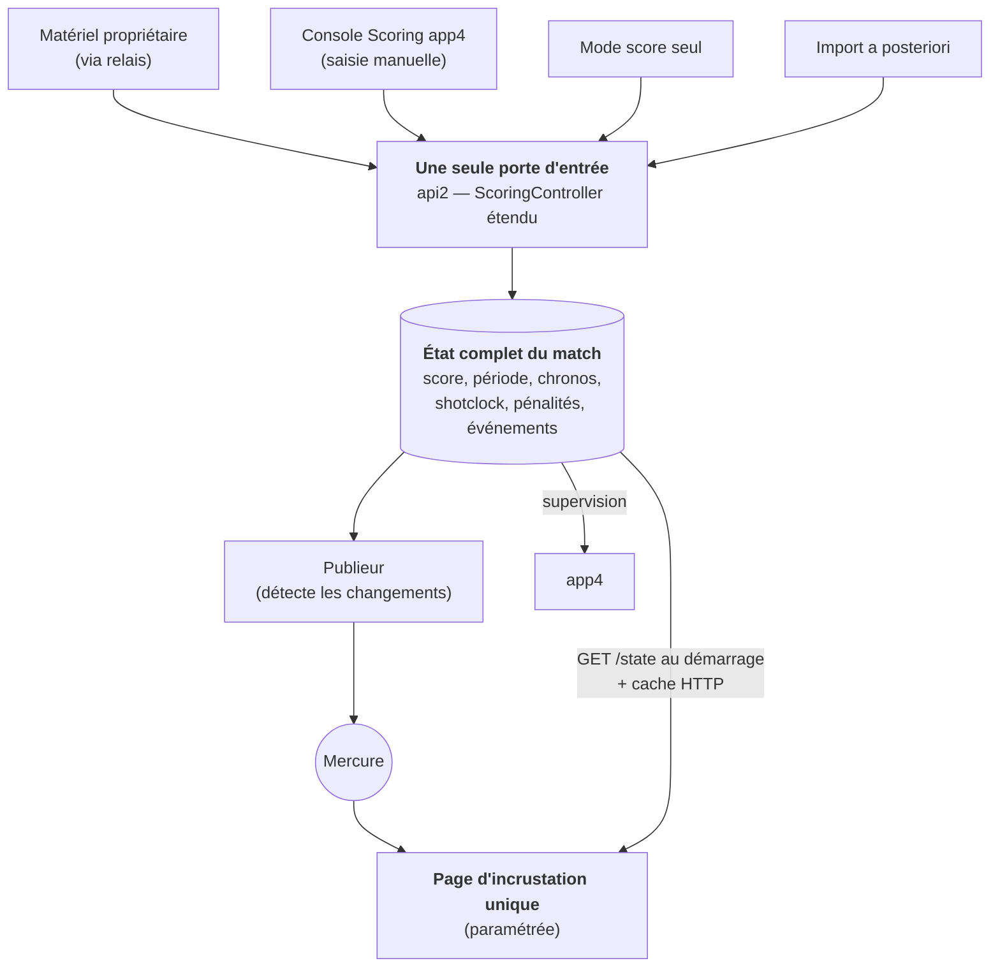

# Refonte du scoring live — Plan de travail

> **Ce document dit ce qu'on va construire, dans quel ordre, et ce qu'on supprimera ensuite.**
> Il ne décrit pas l'existant : pour cela, voir
> [LIVE_MATCH_WEBSOCKET_ARCHITECTURE.md](LIVE_MATCH_WEBSOCKET_ARCHITECTURE.md).
> La revue critique qui a conduit à ces choix est dans
> [LIVE_MATCH_REFACTORING_REVIEW.md](../audits/LIVE_MATCH_REFACTORING_REVIEW.md).
>
> **Principe directeur : on ne touche à rien tant que le neuf ne marche pas.** Le nouveau système se
> construit **à côté** de l'ancien — nouvelles tables, nouveau canal de diffusion. La production
> continue de tourner sur le cache JSON et le broker actuels jusqu'à la bascule, qui se fait
> **incrustation par incrustation, terrain par terrain**.

---

## 1. Le vocabulaire, d'abord

Trois termes reviennent partout. Ils sont simples ; ils sont juste mal expliqués ailleurs.

### 1.1 « Matériel propriétaire »

On désigne ainsi, dans toute la documentation, le **panneau de score du commerce** installé sur les
terrains équipés : la console de saisie de la table de marque, sa passerelle réseau, et le
**protocole fermé** (non documenté publiquement) qu'elle parle. C'est la source de vérité de la
saisie **sur les terrains qui en disposent** — mais tous n'en ont pas, d'où les modes de saisie
alternatifs.

Ce qu'il faut retenir : c'est un **format externe qu'on subit**. Il ne doit jamais fuiter dans notre
modèle de données. On le traduit **une seule fois, au plus près de l'entrée**, vers notre propre
vocabulaire (`but`, `carton`, `chrono démarre`, `chrono s'arrête`).

### 1.2 Mercure

**Ce n'est pas une technologie exotique : c'est une autre façon de faire ce que le broker WebSocket
actuel fait déjà** — pousser des messages du serveur vers les écrans, en temps réel. Trois
différences pratiques :

- C'est un **logiciel standard** (un « hub »), maintenu par la communauté Symfony, qu'on installe à
  côté d'api2. Ce n'est plus un dépôt personnel à maintenir dans le chemin critique.
- Le navigateur s'y connecte en **SSE** (*Server-Sent Events*) : un WebSocket en plus simple, à
  **sens unique**. Le serveur envoie, l'écran reçoit. Une incrustation n'a jamais besoin de parler
  dans l'autre sens — SSE suffit largement.
- **Il rejoue tout seul les messages ratés.** C'est le vrai gain. Si une incrustation perd le réseau
  20 secondes, à la reconnexion elle dit « je m'étais arrêtée au message n° 412 » et le hub lui
  renvoie 413, 414, 415… Sans Mercure, il faut **coder ce rattrapage à la main** (numéro de version,
  détection de trous, demande de resynchronisation). Avec Mercure, on ne l'écrit pas.

### 1.3 Cache HTTP

Même objectif que le cache JSON actuel — **éviter de taper la base à chaque affichage** — mais sans
worker qui écrit des fichiers.

| | Aujourd'hui | Demain |
|---|---|---|
| **Mécanisme** | un worker recalcule `10842_match_score.json` toutes les N secondes ; l'écran lit le fichier | l'écran appelle `GET /api2/scoring/state/10842` ; **Nginx garde la réponse en mémoire quelques secondes** |
| **Fraîcheur** | dépend de la cadence du worker (risque de fichier périmé) | invalidé par l'état lui-même (`ETag` / `updated_at`) |
| **À maintenir** | un worker de génération, des fichiers sur disque | rien : une en-tête HTTP |

Même soulagement de la base, sans worker de génération et sans risque de fichier périmé.

---

## 2. Le problème, en une phrase

**L'état du match n'existe nulle part en entier.**

Il est éparpillé : un peu dans le matériel propriétaire (qui a son propre état, qu'on ne peut pas
corriger à distance), un peu dans la **mémoire d'un onglet de navigateur** (`app_wsm`, qui doit
rester ouvert 5 jours d'affilée), un peu dans le broker (qui ne garde rien), un peu dans la base. Le
**shotclock** et les **pénalités** ne sont écrits nulle part : ils transitent et disparaissent.

Tout le reste en découle :

| Symptôme | Cause |
|---|---|
| Un onglet Chrome doit rester ouvert pendant tout l'événement | c'est lui qui porte l'état et fait le relais |
| Un match resté « en attente » ne persiste **aucun** événement | la machine à états vit dans l'onglet |
| Le shotclock est perdu à la moindre coupure | il n'est jamais écrit |
| Changer de mode de saisie en cours de match est risqué | chaque mode a **son** état, pas un état commun |
| ~20 pages d'incrustation PHP quasi identiques | chacune reconstruit l'affichage depuis des fichiers |

---

## 3. La cible

**La base porte l'état complet du match.** Une seule phrase — tout le reste en découle.



Une fois l'état en base, **tout devient simple** :

- **Toutes les sources écrivent au même endroit, dans le même format.** Le matériel propriétaire, la
  console Scoring, le mode « score seul », un import après coup : chacune est un simple *adaptateur*
  qui produit les mêmes commandes (`but`, `carton`, `chrono démarre`…). Peu importe d'où ça vient.
- **Mercure a quelque chose à pousser.** Il diffuse les changements d'état.
- **Un écran qui redémarre lit l'état en base** et repart au bon endroit — au lieu de dépendre de ce
  qu'un onglet avait en mémoire.
- **Changer de mode de saisie en cours de match ne perd rien** : l'état reste, on change seulement
  qui a le droit d'écrire.

> ⚠️ **Boussole.** Mercure n'est **pas** la refonte : c'est un tuyau. Remplacer le broker par Mercure
> sans faire l'état canonique, ce serait remplacer un tuyau par un autre tuyau — et garder l'onglet
> fragile, le shotclock perdu et les 20 pages dupliquées. **Le tuyau est secondaire ; l'état
> canonique est le sujet.**

### 3.1 Le chrono : le point qui fait peur, mais qui est déjà résolu

C'est ici que la plupart des gens bloquent : *« si je stocke le chrono en base, il faut écrire 10
fois par seconde ? »* **Non — et le système actuel fait déjà la bonne chose sans le dire.**

On ne stocke **pas le temps qui défile**. On stocke **quatre valeurs** :

| Valeur | Exemple |
|---|---|
| Durée de départ | 10 min (`600000` ms) |
| Temps déjà écoulé au dernier arrêt | `183000` ms |
| Heure du dernier départ | `2026-07-14T15:32:07.412Z` |
| Ça tourne / c'est arrêté | `true` |

Avec ces quatre valeurs, **n'importe quel écran recalcule le temps affiché tout seul**, au dixième
de seconde, **sans réseau** :

```
temps restant = durée de départ − temps écoulé − (maintenant − heure du dernier départ)
```

Le réseau ne transporte **que les moments où quelqu'un appuie sur play/pause**. Le tic-tac est
purement local, à 60 images par seconde, gratuit.

C'est **déjà ce que fait le système actuel** : le relais n'écrit en base qu'au démarrage et à
l'arrêt du chrono, et l'incrustation interpole localement. La refonte ne fait qu'**étendre ce
mécanisme au shotclock et aux pénalités**, qui aujourd'hui n'existent que le temps du direct.

**On ne perd aucune précision — on en gagne :**

| Chrono | Aujourd'hui | Après |
|---|---|---|
| **Chrono de jeu** | horloge en base, dixième dérivé à l'affichage | **identique**, plus récupérable après un crash |
| **Shotclock** | jamais écrit — perdu à la moindre coupure | horloge persistée |
| **Pénalités** | reçues, jamais exploitées | N horloges, liées au joueur |

### 3.2 Une seule page d'incrustation

Aujourd'hui : une vingtaine de pages PHP quasi identiques (`score.php`, `score_o.php`,
`score_club_e.php`, `next_game.php`, `teams.php`, `multi_score.php`…). Mêmes données, variantes
mécaniques : nations/clubs × suffixes d'affichage (score seul / événements seuls / événements figés
/ HD).

Demain : **une page, des paramètres.** Chaque variante devient une option, pas un fichier :

| Paramètre | Valeurs |
|---|---|
| Terrain | numéro de terrain |
| Blocs affichés | score, chrono, shotclock, pénalités, événements, compositions, prochain match |
| Habillage | nations / clubs |
| Format | standard / HD |

Elle fonctionne en deux temps : elle **lit l'état de départ** (`GET /state`, servi par cache HTTP),
puis **s'abonne à Mercure** — et **uniquement aux flux dont elle a réellement besoin** (inutile de
recevoir le chrono si on n'affiche que le score).

**C'est le plus gros gain caché de la refonte**, et c'est **la condition pour que le cache JSON
puisse mourir** : tant que ces 20 pages existent, il faut continuer à générer les fichiers pour
elles.

---

## 4. Les décisions déjà tranchées

C'étaient les seuls points réellement difficiles. Ils sont **actés avant tout code** ; le reste est
de l'exécution.

### 4.1 Qui a le droit d'écrire : une seule source à la fois

Pas de « les deux écrivent, le dernier gagne » — trop risqué en situation de match.

- Chaque terrain a **une source active** (matériel / console manuelle / score seul).
- Chaque commande porte **qui l'envoie, à quelle heure, avec quel identifiant unique**.
- Les commandes d'une source **non active** sont **journalisées mais jamais appliquées**.
- Changer de source = une **promotion**, horodatée. L'état déjà en base est **conservé tel quel**.
- Au rattrapage après une coupure, les commandes **antérieures à la dernière promotion** sont
  **rejetées** : elles dateraient d'avant la bascule et écraseraient des corrections manuelles.
  L'identifiant unique protège du double-envoi.

**Divergence entre la base et le matériel** (la base dit 3–2, le panneau affiche 4–2) : **pas de
résolution automatique.** Le matériel a son propre état, incorrigible à distance. Tant qu'il est la
source active, il fait foi. La supervision app4 lève une **alerte** et l'opérateur tranche.

### 4.2 Les horodatages viennent du client, pas du serveur

Un relais posé sur le terrain doit pouvoir **encaisser une coupure Internet** et rejouer plus tard.
Pendant la coupure, aucun horodatage serveur n'existe. Si on tamponnait à l'heure de **réception**,
un « chrono démarre » rejoué 10 minutes plus tard décalerait l'horloge de 10 minutes.

Donc : **l'heure vient de celui qui émet la commande**, avec **synchronisation NTP obligatoire** sur
le relais. Le serveur ne sert que d'arbitre et contrôle la dérive.

### 4.3 Les tables `kp_*` restent la vérité pour les résultats

Le live et les résultats sont **deux mondes distincts** :

- Les nouvelles tables (`scoring_live_*`) portent **l'état pendant le match**.
- Les tables `kp_*` restent le modèle de référence pour **les résultats, classements et PDF**.
- L'état live y est **consolidé en fin de match** — comme le fait déjà la clôture actuelle.

Conséquence directe : **le reporting existant n'est jamais impacté** par l'expérimentation, et il n'y
a **aucune double écriture à maintenir** pendant la transition.

### 4.4 Un relais non surveillé a besoin de son propre mot de passe

`/admin/scoring/*` est aujourd'hui protégé par une authentification conçue pour des **humains**. Un
boîtier laissé seul dans un gymnase exige un **identifiant machine** : jeton limité à **un événement
et un terrain**, valable le temps de l'événement, révocable depuis app4. À spécifier **avant** tout
déploiement de matériel.

### 4.5 Nommage : « v2 » est banni

Ce nom désigne **déjà deux choses** dans la base de code (`sources/live/v2/*.php` et la FeuilleMarque
V2) ; un troisième sens garantirait la confusion. Les nouveaux éléments sont nommés par leur **rôle** :
`scoring_live_state`, `scoring_live_clock`, `scoring_live_event`.

---

## 5. La trajectoire

> **Règle de découpage : par flux, pas par date.** N'attends pas que les 5 étapes soient finies pour
> basculer quoi que ce soit — ce serait un big-bang qui ne bascule jamais. Dès qu'une incrustation
> marche (le bandeau score, disons), tu la bascules **elle**, sur **un** terrain, **un** week-end.
> Les autres restent sur l'ancien. Tu apprends en réel sans tout risquer.

### Étape 1 — La base porte l'état complet

**Ce qu'on fait.** Nouvelles tables `scoring_live_*`. On **étend le `ScoringController` d'api2 qui
existe déjà** (mêmes routes `/admin/scoring/*`, même authentification, même journalisation) pour
qu'il porte **tout** ce qui manque : shotclock, pénalités, chronos complets.

**Pourquoi étendre plutôt que créer à côté.** api2 est neuf, authentifié et journalisé, et la console
Scoring d'app4 y est **déjà branchée**. Créer un contrôleur parallèle obligerait à re-migrer la
console juste après sa livraison, et ajouterait un **quatrième** chemin d'écriture aux trois
existants. L'isolation « module parallèle » se justifie vis-à-vis du **legacy PHP**, pas à l'intérieur
d'api2.

**Ce qu'on ne touche pas.** `/api/wsm/*`, les fichiers `sources/live/v2/*.php`, le cache JSON, les
incrustations actuelles. Ils restent la voie de production.

**Comment on se protège des régressions.** Le protocole du matériel propriétaire n'est pas documenté.
On enregistre donc de **vraies sessions** de messages entrants, et les écritures que le relais actuel
produit en réponse. Ces paires deviennent des **fichiers de référence** : la nouvelle traduction doit
les reproduire **à l'identique** avant toute amélioration. C'est la seule protection réaliste sur un
format fermé.

**Livrables.** Tables + routes + machine à états (développée en test-first : c'est de la logique pure,
sans base ni réseau) + fichiers de référence + la table de sortie (`scoring_outbox`, voir étape 2).

---

### Étape 2 — Mercure diffuse cet état

**Ce qu'on fait.** Un petit service serveur détecte les changements en base et les pousse sur Mercure,
**sur un canal séparé** de l'actuel — donc sans perturber les incrustations de production.

**Le mécanisme (table de sortie).** Quand api2 écrit un changement d'état, il dépose **dans la même
transaction** une ligne dans une table `scoring_outbox`. Un worker draine cette table et publie sur
Mercure.

> ⚠️ **Pourquoi une table intermédiaire plutôt que publier directement dans la requête HTTP ?**
> Si Mercure est lent ou en panne, l'écriture de l'état ne doit **jamais** être bloquée ni perdue —
> la base est prioritaire. On écrit donc l'état **et** le message à diffuser dans **une seule
> transaction** : soit les deux, soit aucun. La diffusion réelle se fait **après**, hors du chemin
> critique, et se **rejoue** si Mercure était tombé.

**Quel worker.** On **étend le worker api2 existant** (`app:event-cache-worker`), qui a déjà son
modèle supervisé. On n'ajoute **pas** Symfony Messenger : ce serait un **deuxième modèle de worker à
exploiter** à côté du premier, pour quelques messages par seconde sur 5 terrains. Drainer une petite
table, c'est une requête et une boucle.

**Ce qui disparaît par rapport au plan initial.** Le mécanisme de numéro de version + détection de
trous + demande de resynchronisation, qu'il aurait fallu coder à la main : **Mercure le fournit
nativement.**

---

### Étape 3 — La page d'incrustation unique

**Ce qu'on fait.** Une page qui lit `GET /state` au démarrage (servi par cache HTTP), puis s'abonne à
Mercure — uniquement aux flux dont elle a besoin, selon ses paramètres d'affichage (§3.2).

**Ce qu'elle remplace.** Toute la famille des ~20 pages PHP, et à terme `app_live_dev`.

**On valide en parallèle.** Les anciennes incrustations continuent de tourner sur le cache JSON et
l'ancien broker. On branche la nouvelle page sur un terrain, et on compare.

---

### Étape 4 — On remplace l'onglet WSM

**C'est le plus gros morceau, et il ne peut venir qu'après l'étape 1.** Tant que l'état n'est pas
canonique en base, déplacer le relais ne ferait que **déménager la fragilité**.

**Deux voies possibles**, à trancher quand on aura la réponse à la question ci-dessous :

| Voie | Principe | Condition |
|---|---|---|
| **Boîtier local** | un mini-PC posé près des terrains, sur le réseau local, remplace l'onglet. Il démarre au boot, se relance seul, et **encaisse les coupures Internet** grâce à un tampon local qu'il rejoue ensuite. | aucune — c'est la voie par défaut |
| **Relais serveur** | la passerelle du matériel parle **directement** au serveur KPI ; plus rien à déployer sur le terrain. | ⚠️ **il faut que le matériel puisse émettre vers Internet** — à vérifier auprès du fournisseur |

> ❓ **Question bloquante à poser au fournisseur du matériel : sa passerelle peut-elle initier une
> connexion sortante vers un serveur, ou attend-elle qu'on vienne s'y connecter ?**
> Si oui, tout devient plus simple (plus de matériel à déployer). Si non, c'est le boîtier local — et
> **c'est le cas le plus probable** : un gymnase a rarement un réseau qu'on peut configurer.
> **À obtenir dès maintenant : cette réponse conditionne l'étape 4.**

**Ce que fait le boîtier, précisément.** Le moins possible :

- Il **transmet** les messages du matériel vers KPI, en **filtrant le tic-tac des chronos** (il ne
  garde que les démarrages et les arrêts).
- Il **ne traduit pas** et **ne décide pas** quel match est en cours. La traduction du protocole
  propriétaire et l'aiguillage du match vivent **côté serveur**.

**Pourquoi ce partage.** Si le boîtier traduisait, la **logique métier serait dupliquée sur chaque
boîtier de la flotte**, à mettre à jour à distance — exactement la complexité qu'on cherche à
supprimer. En gardant la traduction côté serveur, elle **existe à un seul endroit**, versionnée avec
le reste du code et testable par les fichiers de référence de l'étape 1. Le boîtier devient un
quasi-firmware : on n'y touche plus jamais.

**Au kit du boîtier** : synchronisation NTP (obligatoire, cf. §4.2) et une **clé 4G de secours** —
« ne dépend pas du réseau du site » suppose quand même une sortie Internet, or les Wi-Fi captifs et le
filtrage sortant existent dans les gymnases.

---

### Étape 5 — Le ménage

Voir §6 — **avec un critère chiffré, sinon le legacy ne meurt jamais.**

---

## 6. Ce qui devient obsolète

À supprimer **dans cet ordre** : chaque ligne dépend de la précédente.

| Quoi | Où | Peut mourir quand |
|---|---|---|
| Les ~20 pages d'incrustation PHP | `sources/live/*.php` | la page unique les couvre toutes (étape 3) |
| La génération du cache JSON | `sources/live/event_worker.php`, `create_cache_match.php` | juste après — elle n'existait que pour ces pages |
| L'app d'incrustation Vue | `sources/app_live_dev/` | la page unique la remplace aussi |
| Le broker WebSocket personnel | dépôt `laurentgarrigue/broker` | plus personne ne s'y abonne (Mercure a pris le relais) |
| Les FeuilleMarque V2 et V3 | `sources/admin/FeuilleMarque2.php`, `FeuilleMarque3.php`, `sources/live/v2/*.php` | la console Scoring d'app4 les remplace |
| Les endpoints de relais | `sources/api/` → `/api/wsm/*` | l'onglet WSM disparaît (étape 4) |
| L'app WSM | `sources/app_wsm_dev/` | idem |

### Le garde-fou

**Fixe un critère chiffré et daté pour autoriser ce ménage.** Par exemple :

> *Le nouveau système a tourné sur **3 événements réels complets** sans **un seul écart** entre ce
> qu'il affiche et la fiche de match de référence.*

Sans critère écrit, on garde le legacy « au cas où » pendant trois ans, et l'objectif d'harmonisation
est manqué.

---

## 7. Récapitulatif : les deux chantiers

La refonte a **deux moitiés**, et il est facile de n'en voir qu'une.

| | La question | Étapes | Sans elle… |
|---|---|---|---|
| **Écriture** (saisir) | Comment l'info **arrive** dans KPI ? | 1, 4 | belle incrustation… toujours alimentée par un onglet Chrome qui peut se fermer |
| **Lecture** (afficher) | Comment les écrans **reçoivent** l'info ? | 2, 3 | l'état est propre, mais les 20 pages dupliquées restent et le cache JSON ne peut pas mourir |

Les deux sont nécessaires. **L'écriture d'abord** : l'étape 1 conditionne tout le reste.

---

## 8. Ce que la refonte fait disparaître

- L'obligation de **laisser un ordinateur et un navigateur ouverts** pendant tout l'événement.
- Les **réglages piégeux** du relais actuel (synchronisation base à activer, match resté « en
  attente » qui ne persiste rien).
- La **perte du shotclock et des pénalités** à chaque coupure.
- Le **risque** de changer de mode de saisie en cours de match.
- La reprise **fragile** basée sur la mémoire du navigateur.
- **~20 pages d'incrustation** quasi identiques, et le worker qui existait pour les alimenter.
