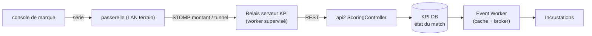
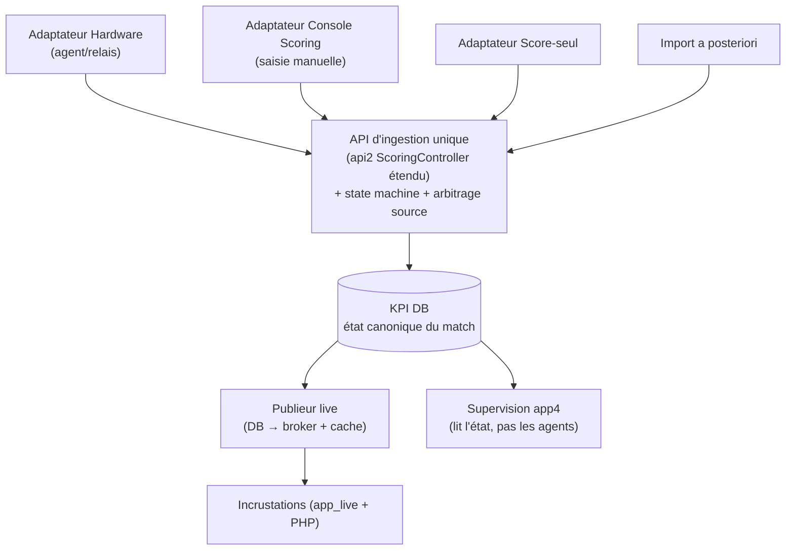

# Refonte du système de scoring live — Propositions d'architecture

> Document de **propositions** (aide à la décision). Il ne décrit pas l'existant en détail :
> pour cela voir [LIVE_MATCH_WEBSOCKET_ARCHITECTURE.md](LIVE_MATCH_WEBSOCKET_ARCHITECTURE.md).
> Il ne modifie aucun code ; il compare des trajectoires de refonte avec avantages,
> inconvénients, forces, faiblesses et complexité de mise en œuvre.

---

## 1. Problème à résoudre

L'architecture actuelle (mode complet propriétaire) fonctionne mais est **trop complexe et trop
fragile en situation de match**. Les points de douleur identifiés par l'exploitation :

1. **Dépendance à un poste + navigateur ouverts** — `app_wsm` (le WebSocket Manager) est une
   app Vue qui doit rester **ouverte dans un onglet** sur un ordinateur pendant **toute la
   durée** de l'événement (2–5 jours) pour faire le relais passerelle STOMP → base + broker. Si
   l'onglet se ferme, la machine se met en veille, ou le Wi-Fi tombe → le relais s'arrête.
2. **Trop de paramètres à gérer manuellement** — sélection d'événement, connexions par terrain,
   `databaseSync` on/off, Set Teams (Current/Next), Sync, broker global, worker de cache… autant
   de réglages qui peuvent être **oubliés** ou **mal positionnés** (ex. un match resté en `ATT`
   ne persiste rien, cf. §10.4 de l'archi actuelle).
3. **Pas de reprise automatique fiable** — la reprise repose sur IndexedDB **local au
   navigateur** ; un crash de l'onglet ou du poste ne relance pas les services tout seul.
4. **État du match dispersé** — la vérité live vit à la fois dans le console de marque (hardware), dans
   la mémoire de `app_wsm` (`statutMatch[]`, `scoreA[]`…), dans le broker (volatil) et dans le
   cache JSON. Certaines données (**shotclock**, **compteur de pénalités**) ne sont **jamais**
   persistées → perdues en cas de coupure.
5. **Modes multiples mal unifiés** — propriétaire complet, Feuille de marque V2 (base seule), V3
   (base + broker), saisie a posteriori, « score seul » (manquant). Chaque terrain d'un même
   événement peut être dans un mode différent, et **basculer** de l'un à l'autre en cours de
   match est aujourd'hui risqué (perte d'état probable).

### 1.1 Objectifs de la refonte

| # | Objectif | Traduction technique |
|---|----------|----------------------|
| O1 | **Zéro poste dédié** | Le relais matériel↔KPI ne doit plus dépendre d'un navigateur ouvert. |
| O2 | **Auto-reprise** | Les services se relancent seuls après crash / perte réseau. |
| O3 | **Fonctionne sans WSM** | Le scoring (saisie manuelle) marche même si le relais matériel est absent. |
| O4 | **Base = source de vérité** | Tout état récupérable/affichable à tout moment depuis la DB, même après crash. |
| O5 | **Modes dégradés first-class** | Incrustation sans hardware, hardware sans incrustation, saisie manuelle, etc. |
| O6 | **Hétérogénéité par terrain** | Terrains dans des modes différents au sein d'un même événement. |
| O7 | **Bascule sans perte** | Changer de mode sur un terrain sans perdre l'état ni les données du match. |

### 1.2 Ce qui existe déjà et doit être capitalisé

La refonte ne part pas de zéro. Sont **déjà en place** :

- **Event Cache Worker serveur** ([`sources/live/event_worker.php`](../../../sources/live/event_worker.php))
  — process CLI PHP en boucle (`while` + `sleep`, gestion `SIGTERM/SIGINT`), piloté par une table
  de config et une interface app4 (`AdminEventWorkerController`). **Indépendant du navigateur** :
  c'est déjà le modèle-cible pour O1/O2. Voir [EVENT_WORKER_README.md](../../../sources/live/EVENT_WORKER_README.md).
- **api2 `ScoringController`** ([`sources/api2/src/Controller/ScoringController.php`](../../../sources/api2/src/Controller/ScoringController.php))
  — réplique déjà les écritures WSM en REST propre : `PUT /admin/scoring/gameParam|gameEvent|gameTimer|playerStatus`, `GET events|gameTimer`. La cible de persistance moderne existe.
- **Console Scoring app4** (spec [PAGE_SCORING.md](../../specs/PAGE_SCORING.md)) — remplace
  FeuilleMarque V2/V3, saisie manuelle direct + post-match, écrit sur api2.
- **Broker WebSocket** (repo séparé [`laurentgarrigue/broker`](https://github.com/laurentgarrigue/broker),
  même VPS que KPI) — diffusion temps réel non-STOMP.

Les propositions ci-dessous **réutilisent** ces briques ; elles diffèrent surtout sur **où vit le
relais passerelle** et **comment on garantit l'état**.

---

## 2. Cause racine : le rôle de `app_wsm` est mal placé

`app_wsm` cumule **quatre responsabilités** dans un client navigateur :

1. **Transport** : connexion STOMP à la passerelle (LAN terrain).
2. **Traduction** : trames propriétaire → modèle KPI.
3. **Persistance** : écritures `/api/wsm/*`.
4. **Aiguillage/UI** : choix du match, supervision, actions manuelles.

Les responsabilités **1–3 sont un service** (doivent tourner sans humain, 24/7, avec reprise) ;
seule la **4 est une UI** (supervision ponctuelle). Les mettre dans le même onglet est la source
de la fragilité. **Le fil rouge de toutes les propositions** : sortir 1–3 du navigateur.

Contrainte physique à garder en tête : la passerelle n'est joignable que sur le **LAN du terrain**.
Donc le composant qui parle STOMP à la passerelle doit être **sur ce LAN** (ou atteindre la passerelle
via un tunnel). C'est le seul vrai point dur ; tout le reste peut vivre côté serveur.

---

## 3. Vue d'ensemble des options

| Option | Idée en une phrase | Où vit le relais passerelle | Effort |
|--------|--------------------|--------------------------|--------|
| **1 — Relais serveur (broker STOMP côté KPI)** | La passerelle pousse vers un service serveur ; plus rien dans le navigateur. | VPS KPI (si passerelle atteignable) | ★★★★☆ |
| **2 — Agent local headless par site** | Un petit démon sur un mini-PC/Raspberry au bord du terrain remplace l'onglet WSM. | Boîtier local (LAN terrain) | ★★★☆☆ |
| **3 — WSM en PWA/Service Worker durci** | On garde WSM navigateur mais on le fiabilise (SW, kiosk, watchdog). | Navigateur (durci) | ★★☆☆☆ |
| **4 — Cible : state machine « match » en base + adaptateurs de source** | Modèle de données unifié : la base porte l'état, chaque mode est un simple *adaptateur* qui l'alimente. | Transverse (couche modèle) | ★★★★★ |

Les options **1/2/3** répondent à O1/O2 (où tourne le relais). L'option **4** est **orthogonale** :
c'est la couche qui garantit O3–O7 quel que soit le relais choisi. **La recommandation combine 4 +
(2 ou 1).**

---

## 4. Option 1 — Relais serveur (le broker STOMP passe côté KPI)

### 4.1 Principe

On déplace la connexion STOMP côté **serveur KPI** : un **worker de relais** (même modèle que
l'Event Worker : process PHP/Node en boucle, supervisé) se connecte aux flux passerelle et écrit
directement dans la base via `ScoringController`. Plus aucun navigateur dans la chaîne de
persistance.

Deux variantes selon l'atteignabilité de la passerelle :

- **1a — passerelle exposée** : la passerelle (ou un port-forward/VPN sur le site) est joignable depuis le
  VPS ; le worker s'y connecte en STOMP sortant.
- **1b — passerelle pousse (webhook/WS inversé)** : la passerelle (ou un mini-relais sur site) initie la
  connexion **vers** le serveur (WebSocket montant ou HTTP POST), traversant le NAT sans config.
  Techniquement 1b ≈ option 2 réduite à sa plus simple expression.



### 4.2 Avantages / Forces
- **O1 pleinement atteint** : aucun poste ni onglet côté exploitant.
- **O2 natif** : le relais est un service supervisé (Docker `restart: always` / systemd), reprise auto.
- **Un seul endroit** à monitorer (le VPS), logs centralisés.
- Réutilise l'infra worker déjà validée (Event Worker) et la persistance api2 déjà écrite.

### 4.3 Inconvénients / Faiblesses
- **Point dur réseau** : exige que la passerelle soit atteignable depuis Internet (1a) — souvent
  **impossible** sur un gymnase/site sportif (NAT, Wi-Fi captif, pas d'admin réseau). 1b lève ce
  point mais **suppose de pouvoir configurer la passerelle** pour émettre vers le serveur, ce qui
  dépend du firmware propriétaire (**à vérifier — risque bloquant**).
- **Latence & coupures Internet** : si le lien du site tombe, plus de scoring du tout (alors qu'un
  agent local, option 2, continuerait de bufferiser).
- **Multi-terrains** : N connexions STOMP à superviser côté serveur, chacune traversant le réseau
  du site.

### 4.4 Complexité : ★★★★☆
Faisabilité **conditionnée** à l'atteignabilité passerelle. Si acquise, l'implémentation est modérée
(porter la logique `wsMixin.js` en worker). Sinon, rédhibitoire.

---

## 5. Option 2 — Agent local headless par site (recommandé pour le relais)

### 5.1 Principe

Sur chaque site, un **petit démon** tourne sur un **mini-PC / Raspberry Pi / NUC** posé près des
terrains, sur le **LAN**. Il remplace l'onglet `app_wsm` : il tient les connexions STOMP passerelle,
traduit, et **écrit dans KPI** (api2). Il embarque un **buffer local** (SQLite/fichier) pour
survivre aux coupures Internet, et rejoue les écritures quand le lien revient.

C'est essentiellement **`app_wsm` transformé en service** (Node headless réutilisant le code
existant, ou portage). Pas d'UI dans l'agent : la **supervision** reste une page web (app4) qui lit
l'état **depuis la base**, pas depuis l'agent.

> **Cas d'usage visé : réseau du site non maîtrisé, passerelle non redirigeable.** C'est précisément
> quand on **ne peut pas** rediriger un port vers la passerelle depuis Internet (option 1 impossible)
> que l'agent est la seule voie : il **initie une connexion sortante** vers KPI (traverse le NAT
> **sans** config réseau du site) tout en restant **sur le LAN** côté passerelle — exactement ce que
> `app_wsm` sait déjà faire, mais en **service headless** au lieu d'un onglet.

```mermaid
flowchart LR
    subgraph site["Site — LAN (mini-PC/RPi)"]
        BXP1["passerelle T1"] --> AG["Agent headless<br/>(daemon supervisé)<br/>+ buffer local SQLite"]
        BXP2["passerelle T2"] --> AG
    end
    AG -->|REST sortant (rejoué si offline)| API["api2 ScoringController"]
    API --> DB[("KPI DB")]
    DB --> WPUB["Worker publieur<br/>(aiguillage + cache + push broker)"]
    WPUB --> LIVE["Incrustations / supervision app4"]
```

### 5.1bis Répartition des rôles : agent mince ↔ worker serveur

L'idée-clé (conforme à votre reformulation) : l'agent ne garde **que** la fonction de pont
passerelle↔KPI ; **tout le reste des rôles de `app_wsm` est déporté** sur le worker serveur et app4.

| Rôle actuel de `app_wsm` | Où il va | Pourquoi |
|--------------------------|----------|----------|
| **1. Transport** STOMP ↔ passerelle (LAN) | ✅ **reste sur l'agent** | seul rôle qui *doit* être sur le LAN du terrain |
| **2. Traduction** trames propriétaire → commandes | ⚖️ **au choix** (agent ou serveur) — voir variantes | équilibre autonomie ↔ maintenabilité |
| **3. Persistance** `/api/wsm/*` (→ api2) | ➡️ **déporté serveur** : l'agent POST, KPI écrit | l'état vit en base (O4) |
| **4a. Aiguillage** (quel match, Set Teams, cache) | ➡️ **worker serveur** (via `active_source` en base) | évite de recréer la complexité sur le boîtier |
| **4b. Supervision / UI** | ➡️ **app4** (lit la base, pas l'agent) | un seul poste de supervision, à distance |

**Point d'attention** : l'**aiguillage** (rôle 4a) doit venir du serveur, **pas** du boîtier —
sinon on redéplace sur l'agent la complexité qu'on cherche justement à supprimer. L'agent ne
**décide** rien du match : il transmet des commandes ; c'est le serveur qui les **impute** au bon
match courant (§7.4, `active_source`).

**Deux variantes selon où vit la traduction (rôle 2) :**

| Variante | Ce que fait l'agent | Force | Faiblesse |
|----------|---------------------|-------|-----------|
| **Agent « dumb pipe »** | relaie les messages STOMP **bruts** vers KPI ; le **worker serveur traduit** | boîtier quasi immuable (jamais de MAJ métier) ; **une seule** version de la logique propriétaire (serveur) | traduction dépend du lien Internet (le buffer couvre les coupures) |
| **Agent « smart »** *(recommandé)* | **traduit** (réutilise `wsMixin.js`) et POST des **commandes normalisées** (`goal`, `card`, `clock run/stop`) | **autonome** ; buffer local rejoue des **commandes propres** après coupure | logique propriétaire sur le boîtier → à mettre à jour à distance (fleet) |

### 5.2 Avantages / Forces
- **O1 atteint** : plus d'onglet à surveiller ; le boîtier démarre au boot, tourne tout seul.
- **O2 natif** : supervisé par systemd/Docker sur le boîtier → **redémarrage auto** après crash.
- **Résilience Internet (fort atout vs option 1)** : le **buffer local** encaisse les coupures
  WAN ; rien n'est perdu, tout est rejoué. C'est la meilleure réponse à O4 côté terrain.
- **Reste sur le LAN** : pas besoin d'exposer la passerelle à Internet → **pas de point dur réseau**.
- **Réutilise le code WSM** : la logique de traduction est déjà écrite et éprouvée.

### 5.3 Inconvénients / Faiblesses
- **Matériel à déployer/maintenir** : un boîtier par site (ou par événement itinérant). Logistique,
  provisioning, mises à jour à distance, un SPOF physique de plus (mitigé par le fait qu'il est
  peu coûteux et remplaçable ; en secours, la console Scoring manuelle prend le relais — O3).
- **Fleet management** : gérer plusieurs boîtiers (versions, config, télémétrie) demande un minimum
  d'outillage (Balena, Ansible, ou simple image Docker + auto-update).
- **Effort de portage** : transformer `app_wsm` (Vue, IndexedDB, cycle navigateur) en daemon Node
  (pas de DOM, persistance SQLite, reconnexion robuste) est non trivial mais borné.

### 5.4 Complexité : ★★★☆☆
Effort logiciel modéré (portage + buffer + supervision) ; coût **logistique** réel mais maîtrisable.
**Meilleur compromis fiabilité/faisabilité** pour le relais hardware, car il ne dépend pas de la
config réseau du site.

---

## 6. Option 3 — WSM navigateur durci (PWA + kiosk + watchdog)

### 6.1 Principe

On **garde** `app_wsm` dans un navigateur mais on attaque chaque cause de fragilité :

- **Service Worker + PWA** : la logique de relais migre dans un Service Worker (survit à la
  fermeture d'onglet, tourne en arrière-plan tant que le navigateur vit).
- **Mode kiosque** : poste dédié en kiosk (Chrome `--kiosk`), veille désactivée, relance auto de
  Chrome par l'OS si crash.
- **Watchdog** : heartbeat vers le serveur ; si le heartbeat s'arrête, alerte (mail/notif) pour
  intervention humaine.
- **`databaseSync` toujours ON**, plus de piège de config (suppression des réglages dangereux).

### 6.2 Avantages / Forces
- **Effort le plus faible** : on capitalise 100 % de `app_wsm` existant.
- Pas de matériel nouveau si un poste est déjà sur place.
- Améliore réellement O2 (kiosk relance) et réduit O1 (SW survit à l'onglet).

### 6.3 Inconvénients / Faiblesses
- **N'élimine pas O1** : il faut toujours un **poste allumé** avec un navigateur vivant. Un Service
  Worker **n'est pas un vrai démon** : il peut être tué par le navigateur (throttling arrière-plan,
  pression mémoire) et **ne redémarre pas seul** sans onglet ouvert. Fiabilité en deçà d'un daemon.
- **Watchdog = humain dans la boucle** : la reprise n'est pas totalement automatique.
- Dette technique : on prolonge une architecture navigateur qu'on cherche justement à quitter.

### 6.4 Complexité : ★★☆☆☆
Rapide à livrer, **gain partiel**. Bon **palier transitoire** (semaines) en attendant l'option 2,
pas une cible durable.

---

## 7. Option 4 — Cible transverse : state machine « match » en base + adaptateurs de source

> C'est **la** proposition structurante. Elle est **indépendante** du choix 1/2/3 et répond à
> O3–O7. Sans elle, on ne fait que déplacer la fragilité.

### 7.1 Principe

On érige la **base KPI comme unique source de vérité de l'état live**, et on définit un **modèle
d'état de match explicite** (une petite machine à états) que **n'importe quelle source** vient
alimenter via **une seule API d'ingestion** (l'api2 `ScoringController`, étendue).

Chaque **mode** devient un simple **adaptateur** qui produit les **mêmes commandes** vers cette API :

| Adaptateur (source) | Produit vers l'API d'ingestion |
|---------------------|--------------------------------|
| **Hardware Scoring** (propriétaire via agent/relais, opt. 1/2/3) | goal/card/timer/period/score |
| **Console Scoring app4** (saisie manuelle directe) | goal/card/timer/period/score |
| **Score-seul** (mode E manquant) | score uniquement |
| **Import a posteriori** | événements à froid |

L'état canonique en base comprend **tout** ce qui est aujourd'hui volatil : score, période, chrono
(startTime/runTime/maxTime/action), **shotclock**, **pénalités actives**, joueurs actifs, liste
d'événements horodatés, et un **`source` courant** + **`updated_at`** par champ.



### 7.2 Le point clé : découpler *ingestion* et *diffusion*

Aujourd'hui `app_wsm` fait **les deux** (écrit ET rediffuse au broker). On les **sépare** :

- **Ingestion** : les sources écrivent l'état en base (idempotent, horodaté).
- **Diffusion** : un **publieur** (extension de l'Event Worker) lit les changements d'état en base
  et pousse vers le **broker** (temps réel) **et** le **cache JSON**. **Une seule voie** de
  diffusion, alimentée par la base.

Conséquences directes sur les objectifs :

- **O4** : tout est en base → **rien ne se perd** ; un crash de n'importe quel maillon est
  récupérable, l'incrustation se reconstruit depuis la base.
- **O3** : le broker n'est **plus requis pour persister** ; si WSM/agent est absent, la console
  Scoring alimente la même base et l'incrustation reste correcte (via cache, comme le mode B actuel).
- **Shotclock & pénalités enfin persistés** (résout la faiblesse §12.2 de l'archi actuelle) : ils
  deviennent des champs d'état comme les autres, donc survivent aux coupures.

### 7.3 Modes dégradés & hétérogénéité (O5, O6)

Comme chaque terrain n'est qu'un **enregistrement d'état** avec un **adaptateur courant**, on gère
naturellement :

- **Incrustation sans hardware** : adaptateur = console Scoring ou score-seul → base → cache → incrust.
- **Hardware sans incrustation** : agent → base ; on ne branche simplement pas d'incrustation.
- **Terrains hétérogènes** : chaque terrain déclare son mode dans une table `pitch_mode` ; le
  publieur et la supervision s'adaptent par terrain.
- **Mode E (score seul)** : simple adaptateur restreint ; enfin implémentable proprement.

### 7.4 Bascule de mode sans perte (O7)

C'est **le** bénéfice décisif. Puisque l'état vit en base et non dans la source :

1. On introduit un champ **`active_source` par terrain/match** (ex. `HARDWARE`, `MANUAL`, `SCORE_ONLY`).
2. Basculer = **changer `active_source`** ; l'état déjà en base est **conservé tel quel**.
3. Règle d'**arbitrage** pour éviter les conflits (deux sources qui écrivent) :
   - Écritures **taguées par source** + `updated_at` ; la source **non active** est ignorée (ou
     journalisée en shadow) tant qu'elle n'est pas promue.
   - Ou stratégie *last-write-wins* horodatée si l'on veut autoriser le co-pilotage.
4. La reprise (agent qui revient après coupure) fait un **`GET` de l'état courant** puis se
   **resynchronise** dessus au lieu d'imposer son état local — inverse de la logique actuelle
   (où le local du navigateur fait foi).

### 7.5 Avantages / Forces
- Répond à **O3–O7 d'un coup**, indépendamment du transport hardware.
- Rend les **modes dégradés first-class** au lieu de cas particuliers fragiles.
- **Testable** : l'ingestion est une API pure, rejouable, sans matériel (le Faker devient de simples
  requêtes HTTP).
- Capitalise sur `ScoringController` + Event Worker déjà présents.
- **Conserve la précision au dixième** des chronos et **persiste enfin** shotclock + pénalités
  (aujourd'hui volatils) — voir le détail en **§7.8**.

### 7.6 Inconvénients / Faiblesses
- **Effort de conception** le plus élevé : modèle d'état, migrations DB, règles d'arbitrage,
  publieur DB→broker.
- **Migration** : cohabiter avec l'existant (`/api/wsm/*`, cache actuel) pendant la transition.
- Nécessite de **figer la sémantique** de chaque commande (idempotence, ordre, horodatage).

### 7.7 Complexité : ★★★★★
La plus lourde, mais c'est un **investissement de fond** : une fois la couche en place, chaque mode
et chaque transport devient trivial à brancher. **À faire par incréments** (cf. §9).

### 7.8 Garde-t-on la précision au dixième de seconde ? (chrono, shotclock, pénalités)

> Question décisive pour la viabilité de l'option 4. **Réponse : oui, sans perte — et on
> *récupère* même une précision aujourd'hui perdue** — à condition de persister le chrono comme
> **modèle d'horloge**, pas comme un flux de valeurs.

#### 7.8.1 Ce que fait *réellement* le mécanisme actuel (vérifié dans le code)

Contre-intuitivement, **la base n'est PAS écrite à chaque tick**. En lisant
[`app_wsm_dev/src/mixins/wsMixin.js`](../../../sources/app_wsm_dev/src/mixins/wsMixin.js) (handler
`/game/chrono`, abonnement `TPS-JEU`) :

- La passerelle émet le chrono en **continu** (plusieurs messages par seconde), le temps arrivant en
  **millisecondes** : `{ chronoName: 'TPS-JEU', value: 581712, initValue: 600000, started: true }`.
- **L'écriture en base ne se déclenche qu'aux transitions run/stop** :
  ```js
  if (chrono.started !== this.statutChrono[id]) {      // ⟵ seulement quand ça change
    this.statutChrono[id] = chrono.started
    const action = chrono.started ? 'run' : 'stop'
    this.syncTimer(this.game[id].id_match, this.tpsJeu[id], chrono.initValue, action)
  }
  this.broadcast(id, '/chrono', { time: this.tpsJeuFormated[id], run: this.statutChrono[id] })
  ```
  Ce qui est persisté via `setGameTimer()` / `PUT /api/wsm/gameTimer`, c'est donc un **modèle
  d'horloge** (`startTime`, `runTime`, `maxTime`, `action`) — **pas** une valeur retransmise chaque
  dixième.
- **Le dixième de seconde n'est jamais stocké.** Il est **dérivé à l'affichage** : sous
  `10 000 ms`, `msToMMSS(value, …, true)` formate en dixièmes ; au-dessus, arrondi à la seconde. Le
  **broker** rediffuse chaque tick pour que l'incrustation réaffiche ce dixième en temps réel, mais
  il ne laisse **aucune trace** persistée.

**Conclusion sur l'existant** : la précision au dixième vit **uniquement dans le flux broker
volatil** ; la base ne porte que l'**horloge** (assez pour reconstruire le temps exact à tout
instant). C'est exactement le compromis que l'option 4 doit **généraliser**, pas casser.

#### 7.8.2 Le principe retenu : stocker l'horloge, pas le tic-tac

Un chrono se reconstruit **au dixième près, à n'importe quel instant, sur n'importe quel écran**
avec seulement **quatre champs** :

| Champ persisté | Rôle |
|----------------|------|
| `init_ms` | valeur de départ du décompte (ex. `600000` = 10 min ; `60000` = shotclock) |
| `elapsed_ms` | temps écoulé **figé au dernier arrêt** |
| `started_at` | timestamp **serveur** du dernier `run` (null si arrêté) |
| `running` | `true` / `false` |

L'affichage est **dérivé** en temps réel côté écran :
```
maintenant = running ? (now − started_at) : 0
restant    = init_ms − elapsed_ms − maintenant
affichage  = format(restant)   // dixièmes sous 10 s, comme aujourd'hui
```

- Tant que `running = true`, chaque écran **calcule le dixième localement** à partir de
  `started_at` → fluide, sans réseau, **identique à l'actuel**.
- On ne persiste à nouveau qu'au `stop` suivant (`elapsed_ms += durée du run`).
- **Le réseau ne porte que les événements** (`run`, `stop`, `raz`, correction manuelle), **jamais
  le tic-tac** → même charge réseau qu'aujourd'hui, mais désormais **récupérable après crash** : un
  écran qui se rebranche lit l'horloge en base et retrouve le dixième juste (à la dérive d'horloge
  NTP près, négligeable).

> **Précision exacte du chrono principal : inchangée.** On garde strictement le comportement
> actuel (dixième dérivé de l'horloge, bascule sous 10 s). On ne dégrade rien.

#### 7.8.3 Les trois familles de chronos dans le modèle

Le modèle « horloge » se décline en une **table d'horloges** (une ligne par chrono actif, reliée au
match — et au joueur pour les pénalités) :

| Chrono | Source passerelle | Précision cible | Aujourd'hui | Avec option 4 |
|--------|---------------|-----------------|-------------|---------------|
| **Principal (jeu)** | `TPS-JEU` | dixième sous 10 s | horloge en base + dixième au broker (volatil) | **identique**, + reconstruction après crash |
| **Shotclock** | `POSSES` | dixième | **broker seul — jamais persisté** (§12.2 archi) | devient une **horloge persistée** |
| **Pénalités × N** | `PEN_H1/H2/G1/G2` | seconde/dixième | **reçu mais non exploité** (§9.6, §12.2) | **N horloges** liées au joueur/équipe |

**On ne perd donc aucune précision, on en gagne** : le shotclock et les pénalités — aujourd'hui
absents de la fiche et perdus à la moindre coupure — deviennent des horloges persistées, donc
récupérables et affichables à tout moment (objectif O4).

#### 7.8.4 Nuance importante (à ne pas mal comprendre)

La state machine **ne stocke pas 10 valeurs par seconde** — ce serait inutile, coûteux en
écritures, et sans bénéfice (le dixième se recalcule trivialement). Elle stocke **l'état de
l'horloge** et laisse chaque écran **dériver le dixième**. Si un jour un besoin d'**horodatage
fin** apparaissait (ex. buts à la milliseconde pour un litige vidéo), il serait porté par
l'**événement** (`goal`/`card` avec `period` + `MM:SS.d` calculé depuis l'horloge au moment du
clic), pas par un échantillonnage du chrono — cohérent avec le champ « temps de l'événement » déjà
prévu dans la console Scoring ([PAGE_SCORING.md](../../specs/PAGE_SCORING.md) §6.4).

### 7.9 Diffusion : comment les changements d'état font défiler les chronos ?

Une fois l'état en base, comment les incrustations « voient » les changements et font **défiler**
les chronos au dixième ? Il faut distinguer **deux couches** que le système actuel sépare déjà —
c'est la clé de la sobriété réseau.

#### 7.9.1 Deux couches : le tic-tac (local) vs le changement d'état (réseau)

> **Constat vérifié dans le code existant** : le mécanisme « horloge » que propose l'option 4
> **existe déjà** dans les incrustations PHP. Le cache `_match_chrono.json` porte déjà
> `run_time`, `start_time_server`, `max_time`, `action`, `tick` (voir
> [`live/js/actions.js`](../../../sources/live/js/actions.js) `ParseCacheChrono`) et le JS local
> fait **défiler le chrono par interpolation**, sans réseau. L'option 4 ne fait que **généraliser**
> ce mécanisme (shotclock + N pénalités) et le rendre **push** plutôt que **poll**.

| Couche | Qui la porte | Ce qu'elle transporte | Fréquence |
|--------|--------------|-----------------------|-----------|
| **A — Tic-tac visuel** | 100 % **local** (JS de l'incrustation) | rien : interpolation `restant = max − (now − start_time_server)` | chaque frame (~60 fps), **zéro réseau** |
| **B — Changement d'état** | **réseau** (broker) | uniquement les *événements* : `run`, `stop`, `raz`, correction, but, carton, nouveau match | **seulement quand ça change** |

**Le réseau ne transporte jamais le tic-tac.** Le dixième défile côté écran par interpolation à
partir de `start_time_server` ; le réseau n'intervient qu'aux **transitions**. C'est ce qui permet
le dixième **sans** surcharge réseau — exactement le problème que le polling par intervalles fixes
(paramètres/X s, score/Y s, temps/Z s) ne savait pas résoudre.

#### 7.9.2 Détection du changement : `tick` de version

Chaque écriture d'état incrémente un **`tick`** (numéro de version, par match et par type de
donnée). Le consommateur ne ré-agit **que si le `tick` a changé** — logique déjà présente :

```js
if (jsonData.tick == theContext.Match.GetTickChrono(rowMatch))
    return   // état déjà pris en compte → on ne touche pas à l'horloge locale
```

En **push broker**, ce `tick` accompagne chaque message : l'incrustation reçoit
`{ clock, tick, action, start_time_server, elapsed_ms, max_ms }`, vérifie que le `tick` est
nouveau, **resynchronise son horloge locale** sur ces valeurs, puis laisse l'interpolation reprendre.
Le `tick` sert aussi à **détecter les trous** (message manqué → `tick` non contigu → l'incrustation
peut demander un resync ou relire l'état courant).

#### 7.9.3 Push broker retenu (vs polling)

> **Décision : push broker, pas polling.** Le polling par intervalles fixes a déjà été écarté en
> exploitation : il force un compromis entre charge réseau et fraîcheur, et **ne tient pas le
> dixième** (il faudrait poller ~10 fois/s le chrono). Le push broker n'émet **que sur changement**
> et laisse l'interpolation locale assurer le dixième → **fraîcheur immédiate ET réseau sobre**.

Le broker temps réel **existe déjà** ([`laurentgarrigue/broker`](https://github.com/laurentgarrigue/broker),
même VPS) et est un **WebSocket natif non-STOMP** : `app_live` s'y abonne via
`new WebSocket(url, topic)` et reçoit des messages JSON `{ p, t, v }` (clé de terrain, topic, valeur).
On **réutilise ce canal** ; on change seulement **qui publie** : plus `app_wsm` dans un onglet, mais
un **publieur serveur**.

#### 7.9.4 Le publieur DB → broker : quelle techno ?

Le publieur est un **petit service serveur** qui : (1) détecte les changements d'état en base,
(2) construit le message `{ p, t, v, tick }`, (3) le pousse au broker WebSocket. Options par
brique :

**A. Détection du changement en base** (la partie sensible) :

| Approche | Principe | Avantage | Inconvénient |
|----------|----------|----------|--------------|
| **Table outbox** *(recommandé)* | chaque écriture d'ingestion (api2 `ScoringController`) insère une ligne dans `scoring_outbox` (match, type, payload, tick) ; le publieur la draine et marque `published_at` | **ordonné, rejouable**, découplé, survit au crash du publieur (rien n'est perdu, on reprend où on s'est arrêté) | une table + un index à gérer |
| **Polling `updated_at`** | le publieur lit les lignes d'état modifiées depuis son dernier scan | simple, s'intègre à l'Event Worker | risque de rater des transitions rapprochées ; pas d'ordre garanti |
| **Trigger / event DB** | `AFTER UPDATE` MariaDB → file | réactif | peu portable, logique métier en base, difficile à tester |

**B. Transport DB → publieur** (comment le publieur est *réveillé*) : un **poll court de l'outbox**
(200–500 ms) suffit — on ne poll qu'**une petite table de deltas**, pas les données de match, donc
la charge est négligeable et la latence imperceptible (le tic-tac restant local, ce poll ne
concerne que les *transitions*). Alternative plus réactive : notifier le publieur en HTTP depuis
api2 après écriture (webhook interne), l'outbox restant le filet de sécurité.

**C. Le process publieur lui-même** — trois candidats, tous déjà réalisables dans la stack :

| Techno | Pourquoi | Points d'attention |
|--------|----------|--------------------|
| **Symfony Messenger** *(recommandé pour du neuf en parallèle)* | pattern **natif Symfony 7.3** : `ScoringController` `dispatch()` un message `ScoringStateChanged` sur un **transport async** ; un `MessageHandler` le consomme et pousse au broker. Le « publieur » devient un simple `messenger:consume` (process Symfony standard, supervisé). **L'outbox = le transport `doctrine://`** (réutilise MariaDB, aucune infra nouvelle). | Messenger à activer (`messenger.yaml`, non configuré à ce jour) ; client WebSocket PHP dans le handler |
| **PHP CLI worker** (jumeau Event Worker) | **même modèle opérationnel** que `event_worker.php` (boucle + `pcntl_signal`, supervisé). Réutilise `Bdd_PDO`. Pertinent surtout si l'on veut **fusionner** génération de cache + push broker dans un seul process. | client WebSocket PHP ; drainage d'outbox « à la main » (ce que Messenger fait pour vous) |
| **Node.js worker** | WebSocket **natif/idéal** en Node (`ws`), réutilise la logique JS de `app_wsm`/`app_live`. | ajoute une techno de service à superviser côté serveur |

> **Recommandation : Symfony Messenger avec transport `doctrine://`.** Raisons : (1) c'est le
> pattern **transactional outbox** idiomatique — on `dispatch()` dans la même logique que l'écriture
> d'état, et le transport Doctrine *est* l'outbox, en base, rejouable ; (2) **aucune infra
> nouvelle** (réutilise MariaDB) ; (3) supervision standard (`messenger:consume` sous systemd/Docker) ;
> (4) idéal pour un **module neuf en parallèle** (voir §7.10) sans toucher aux vieux fichiers PHP.
> Le **PHP CLI worker jumeau de l'Event Worker** reste pertinent si l'on préfère **fusionner** cache
> et push dans un seul process supervisé ; Node reste une alternative si l'on veut un pont WS
> idiomatique.

> ⚠️ **La « fusion » écriture-DB + envoi-broker se fait au niveau *atomicité*, pas *synchrone*.**
> On **ne pousse pas** au broker dans la requête HTTP : si le broker est lent/down, l'écriture
> d'état ne doit **jamais** être bloquée ni perdue (priorité à la base — O4). Le bon couplage est
> **transactionnel** : dans une **seule transaction**, on écrit l'état **et** on dépose le message
> de diffusion (outbox / transport Doctrine) — atomique. La diffusion effective vers le broker se
> fait **hors** du chemin critique, par le consumer, et se **rejoue** si le broker était down.

##### Messenger `doctrine://` = polling interne (sans impact sur le dixième)

Nuance à connaître : avec le transport **`doctrine://`**, `messenger:consume` **fait du polling** —
il boucle et interroge la table `messenger_messages` à intervalle régulier (défaut **1 s**,
réglable via `--sleep`, ex. `--sleep=0.3`). Il faut donc distinguer **deux étages** :

| Étage | Mécanisme | Polling ? |
|-------|-----------|-----------|
| **api2 → publieur** (drainage de l'outbox) | `messenger:consume` lit `messenger_messages` | **oui** (transport Doctrine) |
| **publieur → écrans** (diffusion) | le handler `send()` au broker → push aux abonnés | **non, push** |

**Ce polling n'affecte pas la précision au dixième** : le dixième défile par **interpolation
locale** côté écran (§7.9.1). Le polling Messenger ne fait que déterminer avec quel délai
(0,3–1 s) un **changement d'état** (stop, but, carton) se propage — un délai sub-seconde y est
parfaitement acceptable. Le « push broker, pas polling » de §7.9.3 reste donc vrai **au niveau qui
compte** (la diffusion vers les écrans est bien du push) ; le polling résiduel est **interne**,
borné à une petite table, et sans conséquence perceptible.

- **Pour zéro polling même à l'étage 1** : transport Messenger « push » — `redis://` (blocage
  `XREAD`), AMQP/RabbitMQ, ou beanstalkd — qui réveillent le consumer sans scrutation. Mais c'est
  **de l'infra en plus** pour un gain imperceptible ici (économiser ~0,3 s sur la propagation d'un
  stop). **Recommandé : garder `doctrine://` avec `--sleep` court.**
- **Vigilance opérationnelle** : le `SELECT … FOR UPDATE` de Messenger sur MariaDB peut créer de la
  contention si `--sleep` est très bas avec plusieurs consumers. En pratique `--sleep=0.3`–`0.5` sur
  1–2 consumers pour 5 terrains est large (volume : quelques messages/s, trivial pour MariaDB).

```mermaid
flowchart LR
    ING["Ingestion<br/>api2 ScoringController"] -->|écrit état + insère delta| DB[("KPI DB<br/>état + scoring_outbox")]
    DB -->|poll court de l'outbox<br/>(deltas only)| PUB["Publieur (PHP CLI worker<br/>jumeau Event Worker)"]
    PUB -->|WS { p, t, v, tick }<br/>sur changement uniquement| BRK(("Broker WebSocket<br/>laurentgarrigue/broker"))
    BRK -->|push| LIVE["Incrustations<br/>(interpolation locale du dixième)"]
    PUB -.->|régénère aussi| CACHE["cache JSON<br/>(fallback + resync)"]
    CACHE -.->|lecture d'état au (re)chargement| LIVE
```

#### 7.9.5 Rôle résiduel du cache JSON

Le cache **ne disparaît pas** : il devient le **fallback et le point de resynchronisation**. Une
incrustation qui (re)démarre ou rate des messages lit **l'état courant** dans le cache (ou via un
`GET` d'état api2) pour caler son horloge, puis suit le **push broker** pour les changements. Cela
préserve la compatibilité avec toutes les incrustations PHP existantes (qui lisent le cache) et
garantit O4 : même broker down, l'état reste lisible en base/cache. Voir §7.10.3 pour le détail du
rôle du cache dans le module parallèle.

### 7.10 Stratégie de mise en œuvre : modules parallèles (sans altérer l'existant)

Approche retenue : **construire le nouveau système à côté de l'ancien**, le tester de bout en bout,
puis basculer — sans jamais modifier les chemins de production tant que la nouvelle méthode n'est
pas validée. Trois décisions structurent cette cohabitation.

#### 7.10.1 Tables & routes v2 dédiées (isolation des écritures)

- **Nouvelles tables** `scoring_state`, `scoring_clock`, `scoring_event` (+ le transport Messenger
  `messenger_messages` qui tient lieu d'**outbox**). **On n'écrit pas** dans `kp_chrono` / `kp_match`
  pendant l'expérimentation → l'ancien scoring (`ScoringController` actuel, `v2/*.php`) continue de
  tourner intact.
- **Nouvelles routes** `/admin/scoring/v2/...` en api2, à côté des existantes. L'auth, le contrôle
  d'accès par mandat et la journalisation (`AdminLoggableTrait`) sont **hérités** — bénéfice direct
  vs les `v2/*.php` legacy qui n'ont ni auth ni logging.
- **Topic broker distinct** (ex. clé `p = {event}_{pitch}_v2`) : on branche une **incrustation de
  test** sur le nouveau flux **sans perturber** les incrustations de prod, qui restent sur l'ancien
  topic. Le broker (`laurentgarrigue/broker`) est **le même**, seul le topic change.

> **Bascule** = pointer les incrustations sur le nouveau topic (et/ou faire écrire les tables v2
> vers `kp_*` si l'on veut conserver la compat lecture), une fois la chaîne validée. **Rollback** =
> repointer sur l'ancien topic. Aucune donnée de prod n'a été touchée entre-temps.

#### 7.10.2 Persistance dans api2, pas dans les vieux fichiers PHP

La persistance v2 vit **entièrement dans api2** (contrôleur + service + entités/DBAL), pas dans
`sources/live/v2/*.php`. Le `ScoringController` actuel montre déjà le patron (DBAL direct, JWT,
`assertMatchAuthorized`, journalisation). **Les vieux fichiers PHP ne sont pas modifiés** : ils
restent la voie de prod jusqu'à la bascule, puis sont décommissionnés (P4).

#### 7.10.3 Le cache JSON reste-t-il pertinent avec Messenger ?

**Oui — mais son rôle change.** Messenger est le *transport du push* (DB→broker) ; il **ne
remplace pas** une **source d'état lisible au démarrage** (un abonné WebSocket ne reçoit que le
*futur*, jamais l'état passé). Il faut distinguer trois fonctions que le cache assure aujourd'hui :

| Fonction | Messenger la couvre ? | Conséquence |
|----------|----------------------|-------------|
| **Diffusion temps réel** des changements | ✅ oui (DB→broker→écrans) | le cache **n'est plus la voie temps réel** |
| **Resync / fallback** au (re)démarrage d'un écran | ❌ non | il faut **une source d'état à lire au boot** |
| **Alimenter les incrustations PHP legacy** | ❌ non (elles lisent des `.json` **statiques par chemin fixe** — vérifié dans `live/js/match.js`) | le cache reste **obligatoire** tant qu'elles existent |

Pour la **source de resync**, le module parallèle a désormais un choix (l'état vit en tables v2
propres) :

- **Endpoint api2** `GET /admin/scoring/v2/state/{match}` — lit directement les tables v2. Plus
  frais, pas de fichier à régénérer. **Recommandé pour les *nouvelles* incrustations** (elles font
  `GET state` au boot, puis suivent le broker).
- **Cache JSON** — **obligatoire de toute façon** pour les incrustations PHP legacy, qui ne savent
  lire qu'un fichier statique.

> **Verdict.** Le cache passe de **colonne vertébrale** à **couche de compatibilité** : il ne porte
> plus le temps réel (le broker le fait via Messenger), il ne sert plus qu'aux **vieux écrans** et,
> optionnellement, de fallback. Sa génération est **déjà dans api2** (`EventCacheService`, portage
> de `create_cache_match.php`, via la commande `app:event-cache-worker`) — **aucun vieux fichier PHP
> à faire évoluer**. Le jour où les incrustations legacy sont décommissionnées, la génération de
> cache peut disparaître sans rien casser.
>
> **Changement de rythme induit** : le cache n'a plus besoin d'être régénéré **à chaque changement
> d'état** (le broker s'en charge). `app:event-cache-worker` peut rester sur sa cadence
> d'**aiguillage** (match courant / suivant) ; la fraîcheur temps réel est assurée ailleurs.

```mermaid
flowchart TB
    subgraph new["Module v2 (en parallèle, api2)"]
        ING["POST /admin/scoring/v2/*<br/>(auth + logging hérités)"]
        ING -->|1 transaction : état + message| DB[("Tables v2 + messenger_messages<br/>(outbox Doctrine)")]
        DB -->|messenger:consume| HAND["MessageHandler<br/>→ push broker"]
    end
    HAND -->|topic {event}_{pitch}_v2| BRK(("Broker (inchangé)"))
    BRK -->|push| NEWLIVE["Nouvelles incrustations<br/>GET /v2/state au boot + suivi broker"]
    DB -->|GET /v2/state/{match}| NEWLIVE

    subgraph old["Prod inchangée"]
        OLD["ScoringController + v2/*.php"] --> KP[("kp_chrono / kp_match")]
        EWC["EventCacheService<br/>(app:event-cache-worker)"] --> CACHE["cache JSON"]
        CACHE --> OLDLIVE["Incrustations PHP legacy"]
    end
```

#### 7.10.4 Après le legacy : le JSON « soulage-t-il encore la BDD » ?

Une fois les incrustations legacy décommissionnées, faut-il **garder un cache JSON pour soulager la
base** ? La réponse tient à un constat : **dans le modèle push + interpolation locale, il n'y a
plus de lecture répétée en régime établi.**

- **Écritures** : uniquement aux transitions (quelques/s/terrain) — négligeable.
- **Lectures** : uniquement quand un écran **(re)démarre / resync** (`GET /v2/state`) — rare et
  ponctuel. Le polling `_match_chrono.json` toutes les ~800 ms/écran de l'ancien monde **disparaît**.

Donc le cache **perd sa justification « soulager la BDD »** en régime normal, *sauf* dans ces cas :

| Situation | Cache encore justifié ? |
|-----------|-------------------------|
| Régime normal (écrans abonnés au broker, resync rare) | **Non** — `GET /v2/state` ponctuel suffit, MariaDB ne le sent pas |
| **Rafale** de resync (reconnexion massive après coupure réseau du site) | **Oui** — servir du statique évite N requêtes DB simultanées |
| API/DB momentanément indisponible | **Oui, marginalement** — un fichier sur disque reste lisible |
| Point de resync **hors** api2 (CDN, edge, autre serveur, pur serveur de fichiers) | **Oui** — un fichier se réplique / se met en cache HTTP trivialement |

> **Recommandation (post-legacy) : remplacer le *fichier JSON généré par un worker* par un *cache
> HTTP sur l'endpoint* `GET /v2/state`** (`Cache-Control` / `ETag`, invalidé par `updated_at`). Le
> reverse-proxy déjà en place (Nginx / Traefik) sert la réponse en cache **sans toucher MariaDB**
> pendant N secondes → même « soulagement » de la base, **sans** worker de génération à maintenir et
> **sans** risque de cache périmé (invalidation par état, pas par horloge). Autrement dit, le rôle
> « soulager la BDD » ne disparaît pas : il **change de mécanisme** (fichier généré → cache HTTP).
>
> **Exception** : si l'on veut des incrustations qui tournent **sans dépendre du tout d'api2/PHP**
> (robustesse, service depuis un pur serveur de fichiers ou un CDN), le **fichier JSON statique**
> redevient pertinent — c'est le seul artefact qui survit à une indisponibilité **totale** du backend
> applicatif.

---

## 8. Comparatif de synthèse

| Critère | Opt 1 Relais serveur | Opt 2 Agent local | Opt 3 WSM durci | Opt 4 State machine |
|---------|:---:|:---:|:---:|:---:|
| O1 Zéro poste/onglet | ✅ | ✅ | ⚠️ partiel | — (orthogonal) |
| O2 Auto-reprise | ✅ | ✅ | ⚠️ (kiosk + humain) | — |
| O3 Marche sans WSM | dépend O4 | dépend O4 | dépend O4 | ✅ |
| O4 Base = vérité | dépend O4 | ✅ buffer + O4 | dépend O4 | ✅ (cœur) |
| O5 Modes dégradés | — | — | — | ✅ |
| O6 Hétérogène/terrain | — | — | — | ✅ |
| O7 Bascule sans perte | — | — | — | ✅ |
| Résilience coupure Internet | ❌ (arrêt) | ✅ (buffer) | ❌ | ✅ (buffer + base) |
| Dépend config réseau site | ✅ (bloquant possible) | ❌ | ❌ | — |
| Matériel à déployer | non | **oui (boîtier)** | poste existant | non |
| Réutilise l'existant | api2 + worker | **WSM + api2 + worker** | **WSM** | ScoringController + worker |
| Effort | ★★★★☆ | ★★★☆☆ | ★★☆☆☆ | ★★★★★ |

---

## 9. Recommandation & trajectoire incrémentale

**Recommandation : Option 4 (couche d'état) comme cible, avec l'Option 2 (agent local) comme
transport hardware, et l'Option 3 comme palier transitoire.** L'option 1 reste envisageable
*seulement si* on confirme qu'une passerelle peut émettre vers le serveur (à vérifier auprès de propriétaire).

Raison : O1/O2 sans dépendre de la config réseau des sites = agent local (opt. 2) ; O3–O7 =
couche d'état (opt. 4). Les deux sont complémentaires, pas concurrents.

### Trajectoire suggérée (du moins cher au plus structurant)

| Phase | Contenu | Objectifs couverts | Effort |
|-------|---------|--------------------|--------|
| **P0 — Durcissement immédiat** | WSM en kiosk + `databaseSync` forcé + watchdog heartbeat (opt. 3). Gain rapide sans refonte. | O1(partiel), O2(partiel) | ★★☆☆☆ |
| **P1 — État canonique en base** | Étendre le schéma + `ScoringController` pour porter **tout** l'état live (shotclock, pénalités, chrono complet), horodaté + tagué source. Le publieur DB→broker/cache. | O4, O3 | ★★★★☆ |
| **P2 — Adaptateurs & modes** | Formaliser adaptateurs (Hardware / Console Scoring / Score-seul / Import) sur l'API d'ingestion ; table `pitch_mode` ; `active_source` + arbitrage. | O5, O6, O7 | ★★★☆☆ |
| **P3 — Agent local headless** | Porter `app_wsm` en daemon supervisé + buffer offline ; supervision app4 lit la base. Retrait progressif de l'onglet WSM. | O1, O2 (plein) | ★★★☆☆ |
| **P4 — Décommission legacy** | Retirer `/api/wsm/*`, FeuilleMarque V2/V3, onglet WSM navigateur une fois la console Scoring + agent en production. | dette | ★★☆☆☆ |

> **Ordre important** : faire **P1 avant P3**. Tant que l'état n'est pas canonique en base
> (P1), déplacer le relais (P3) ne fait que déménager la fragilité. Une fois P1 acquis, l'agent
> local devient un simple client d'une API robuste, et la bascule de mode (P2) est triviale.

### Points à trancher avant de démarrer
1. **passerelle peut-elle émettre vers le serveur ?** (débloque/écarte l'option 1). — À vérifier propriétaire.
2. **Matériel agent** : mini-PC vs Raspberry vs conteneur sur un portable déjà présent sur site.
3. **Stratégie d'arbitrage** multi-source : source active exclusive (simple, sûr) vs co-pilotage
   *last-write-wins* (souple, plus risqué).
4. **Périmètre broker** : garde-t-on le broker externe (`laurentgarrigue/broker`) comme unique voie
   temps réel, alimenté par le publieur ? (recommandé : oui).

---

## 10. Ce que la refonte fait disparaître (rappel)

- L'obligation de **laisser un ordinateur + navigateur ouverts** pendant tout l'événement (P0→P3).
- Les **réglages piégeux** de WSM (`databaseSync`, ATT/ON oublié) — forcés ou supprimés.
- La **perte** du shotclock et des pénalités (persistés en P1).
- Le **risque de bascule** entre modes (état en base, `active_source`, P2).
- La reprise **fragile** basée sur l'IndexedDB local (remplacée par resync depuis la base, P1/P3).
