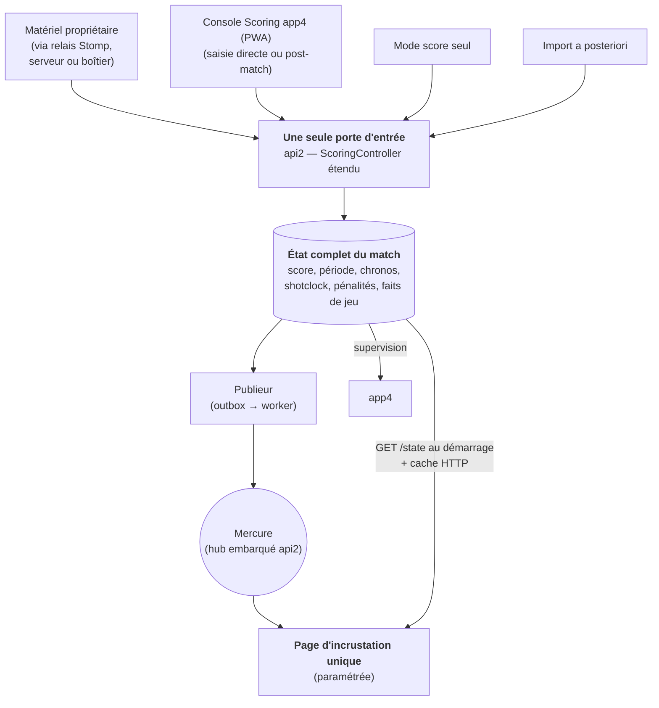

# Refonte du scoring live — Stratégie et plan d'action

> **Statut : stratégie actée (2026-07-23). Ce document n'est plus une proposition.**
> Il dit ce qu'on construit, dans quel ordre, avec quels livrables et quels critères de sortie.
> Il ne décrit pas l'existant : pour cela, voir
> [LIVE_MATCH_WEBSOCKET_ARCHITECTURE.md](LIVE_MATCH_WEBSOCKET_ARCHITECTURE.md).
> La revue critique qui a conduit à ces choix est dans
> [LIVE_MATCH_REFACTORING_REVIEW.md](../audits/LIVE_MATCH_REFACTORING_REVIEW.md).
> La **spécification fonctionnelle détaillée de la console de saisie** est
> [PAGE_SCORING.md](../../specs/PAGE_SCORING.md) — ce plan dit *quand* et *dans quel ordre*,
> la spec dit *quoi* et *comment*.
>
> **Principe directeur : on ne touche à rien tant que le neuf ne marche pas.** Le nouveau système se
> construit **à côté** de l'ancien — nouvelles tables, nouveau canal de diffusion. La production
> continue de tourner sur le cache JSON et le broker actuels jusqu'à la bascule, qui se fait
> **incrustation par incrustation, terrain par terrain**.

---

## 1. Le vocabulaire, d'abord

Trois termes reviennent partout. Ils sont simples ; ils sont juste mal expliqués ailleurs.

> **Note de terminologie — deux « événements ».** Le mot « événement » a **deux sens** dans KPI, à
> ne pas confondre :
> - l'**événement KPI** = un **rassemblement** multi-journées/multi-compétitions sur un site (2–5
>   jours) — c'est ce sens qui apparaît dans « pendant tout l'événement », « `event{id}_pitch{p}` »,
>   « auth scopée événement + terrain » ;
> - le **fait de match** (ou « fait de jeu ») = un **fait ponctuel dans un match** (but, carton ;
>   plus tard tir, passe, arrêt du gardien…) — la table `scoring_live_event`.
>
> Dans ce document, « événement » **seul** désigne l'**événement KPI**. Quand il s'agit d'un but/carton,
> on dit **« fait de match »**. (Le modèle de données est détaillé dans
> [PAGE_SCORING.md §0.4–§0.5](../../specs/PAGE_SCORING.md).)

### 1.1 « Matériel propriétaire »

On désigne ainsi, dans toute la documentation, le **panneau de score du commerce** installé sur les
terrains équipés : la console de saisie de la table de marque, sa passerelle réseau, et le
**protocole fermé** (non documenté publiquement) qu'elle parle. La passerelle expose ce flux en
**WebSocket STOMP sur le réseau local** (cf. architecture §2.2). C'est la source de vérité de la
saisie **sur les terrains qui en disposent** — mais tous n'en ont pas, d'où les modes de saisie
alternatifs.

Ce qu'il faut retenir : c'est un **format externe qu'on subit**. Il ne doit jamais fuiter dans notre
modèle de données. On le traduit **une seule fois, côté serveur**, vers notre propre
vocabulaire (`but`, `carton`, `chrono démarre`, `chrono s'arrête`) — cf. décision §4.7.

### 1.2 Mercure

**Ce n'est pas une technologie exotique : c'est une autre façon de faire ce que le broker WebSocket
actuel fait déjà** — pousser des messages du serveur vers les écrans, en temps réel. Trois
différences pratiques :

- C'est un **logiciel standard** (un « hub »), maintenu par la communauté Symfony. Ce n'est plus un
  dépôt personnel à maintenir dans le chemin critique. Le hub est **embarqué dans le FrankenPHP
  d'api2** — en place et validé en dev (cf. §4.6).
- Le navigateur s'y connecte en **SSE** (*Server-Sent Events*) : un WebSocket en plus simple, à
  **sens unique**. Le serveur envoie, l'écran reçoit. Une incrustation n'a jamais besoin de parler
  dans l'autre sens — SSE suffit largement.
- **Il rejoue tout seul les messages ratés.** C'est le vrai gain. Si une incrustation perd le réseau
  20 secondes, à la reconnexion elle dit « je m'étais arrêtée au message n° 412 » et le hub lui
  renvoie 413, 414, 415… Sans Mercure, il faut **coder ce rattrapage à la main** (numéro de version,
  détection de trous, demande de resynchronisation). Avec Mercure, on ne l'écrit pas.

### 1.3 Cache HTTP

Même objectif que le cache JSON actuel — **éviter de taper la base à chaque affichage** — mais sans
worker qui écrit des fichiers.

| | Aujourd'hui | Demain |
|---|---|---|
| **Mécanisme** | un worker recalcule `10842_match_score.json` toutes les N secondes ; l'écran lit le fichier | l'écran appelle `GET /api2/scoring/state/10842` ; **le serveur web (Caddy/FrankenPHP) garde la réponse en mémoire quelques secondes** |
| **Fraîcheur** | dépend de la cadence du worker (risque de fichier périmé) | invalidé par l'état lui-même (`ETag` / `updated_at`) |
| **À maintenir** | un worker de génération, des fichiers sur disque | rien : une en-tête HTTP |

Même soulagement de la base, sans worker de génération et sans risque de fichier périmé.

---

## 2. Le problème, en une phrase

**L'état du match n'existe nulle part en entier.**

Il est éparpillé : un peu dans le matériel propriétaire (qui a son propre état, qu'on ne peut pas
corriger à distance), un peu dans la **mémoire d'un onglet de navigateur** (`app_wsm`, qui doit
rester ouvert 5 jours d'affilée), un peu dans le broker (qui ne garde rien), un peu dans la base. Le
**shotclock** et les **pénalités** ne sont écrits nulle part : ils transitent et disparaissent.

Tout le reste en découle :

| Symptôme | Cause |
|---|---|
| Un onglet Chrome doit rester ouvert pendant tout l'événement | c'est lui qui porte l'état et fait le relais |
| Un match resté « en attente » ne persiste **aucun** fait de jeu | la machine à états vit dans l'onglet |
| Le shotclock est perdu à la moindre coupure | il n'est jamais écrit |
| Changer de mode de saisie en cours de match est risqué | chaque mode a **son** état, pas un état commun |
| ~20 pages d'incrustation PHP quasi identiques | chacune reconstruit l'affichage depuis des fichiers |

---

## 3. La cible

**La base porte l'état complet du match.** Une seule phrase — tout le reste en découle.



Une fois l'état en base, **tout devient simple** :

- **Toutes les sources écrivent au même endroit, dans le même format.** Le matériel propriétaire, la
  console Scoring, le mode « score seul », un import après coup : chacune est un simple *adaptateur*
  qui produit les mêmes commandes (`but`, `carton`, `chrono démarre`…). Peu importe d'où ça vient.
- **Mercure a quelque chose à pousser.** Il diffuse les changements d'état.
- **Un écran qui redémarre lit l'état en base** et repart au bon endroit — au lieu de dépendre de ce
  qu'un onglet avait en mémoire.
- **Changer de mode de saisie en cours de match ne perd rien** : l'état reste, on change seulement
  qui a le droit d'écrire.

> ⚠️ **Boussole.** Mercure n'est **pas** la refonte : c'est un tuyau. Remplacer le broker par Mercure
> sans faire l'état canonique, ce serait remplacer un tuyau par un autre tuyau — et garder l'onglet
> fragile, le shotclock perdu et les 20 pages dupliquées. **Le tuyau est secondaire ; l'état
> canonique est le sujet.**

### 3.1 Le chrono : le point qui fait peur, mais qui est déjà résolu

C'est ici que la plupart des gens bloquent : *« si je stocke le chrono en base, il faut écrire 10
fois par seconde ? »* **Non — et le système actuel fait déjà la bonne chose sans le dire.**

On ne stocke **pas le temps qui défile**. On stocke **quatre valeurs** :

| Valeur | Exemple |
|---|---|
| Durée de départ | 10 min (`600000` ms) |
| Temps déjà écoulé au dernier arrêt | `183000` ms |
| Heure du dernier départ | `2026-07-14T15:32:07.412Z` |
| Ça tourne / c'est arrêté | `true` |

Avec ces quatre valeurs, **n'importe quel écran recalcule le temps affiché tout seul**, au dixième
de seconde, **sans réseau** :

```
temps restant = durée de départ − temps écoulé − (maintenant − heure du dernier départ)
```

Le réseau ne transporte **que les moments où quelqu'un appuie sur play/pause**. Le tic-tac est
purement local, à 60 images par seconde, gratuit.

C'est **déjà ce que fait le système actuel** : le relais n'écrit en base qu'au démarrage et à
l'arrêt du chrono, et l'incrustation interpole localement. La refonte ne fait qu'**étendre ce
mécanisme au shotclock, aux pénalités et aux pauses inter-périodes**, qui aujourd'hui n'existent
que le temps du direct (ou pas du tout).

**On ne perd aucune précision — on en gagne :**

| Chrono | Aujourd'hui | Après |
|---|---|---|
| **Chrono de jeu** | horloge en base, dixième dérivé à l'affichage | **identique**, plus récupérable après un crash |
| **Shotclock** | jamais écrit — perdu à la moindre coupure | horloge persistée |
| **Pénalités** | reçues, jamais exploitées | N horloges, liées au joueur |
| **Pauses inter-périodes** | inexistantes | horloge indicative persistée (cf. §4.10) |

### 3.2 Une seule page d'incrustation

Aujourd'hui : une vingtaine de pages PHP quasi identiques (`score.php`, `score_o.php`,
`score_club_e.php`, `next_game.php`, `teams.php`, `multi_score.php`…). Mêmes données, variantes
mécaniques : nations/clubs × suffixes d'affichage (score seul / faits de jeu seuls / faits de jeu figés
/ HD).

Demain : **une page, des paramètres.** Chaque variante devient une option, pas un fichier :

| Paramètre | Valeurs |
|---|---|
| Terrain | numéro de terrain |
| Blocs affichés | score, chrono, shotclock, pénalités, faits de jeu, compositions, prochain match |
| Habillage | nations / clubs |
| Format | standard / HD |

Elle fonctionne en deux temps : elle **lit l'état de départ** (`GET /state`, servi par cache HTTP),
puis **s'abonne à Mercure** — et **uniquement aux flux dont elle a réellement besoin** (inutile de
recevoir le chrono si on n'affiche que le score).

**C'est le plus gros gain caché de la refonte**, et c'est **la condition pour que le cache JSON
puisse mourir** : tant que ces 20 pages existent, il faut continuer à générer les fichiers pour
elles.

### 3.3 L'abonnement ciblé : événement + terrain + blocs

**Le problème.** Plusieurs événements KPI peuvent se dérouler **en même temps** (deux tournois le
même week-end, chacun sur ses terrains). Si toutes les incrustations recevaient tout, on aurait des
**conflits d'affichage** : l'écran du terrain 2 de l'événement 236 ne doit voir **que** le flux de ce
terrain-là, jamais celui d'un autre événement. Il faut donc **adresser** finement à quoi chaque
incrustation s'abonne.

**La solution — les *topics* Mercure.** Mercure est nativement organisé en **topics** : un abonné
déclare l'adresse exacte qu'il veut écouter, et ne reçoit que ce qui est publié dessus. On adresse
donc chaque flux par une **URI hiérarchique** événement → terrain → bloc de donnée :

```
/scoring/event/236/pitch/2/score      ← le score du terrain 2 de l'événement 236
/scoring/event/236/pitch/2/clock      ← le chrono du même terrain
/scoring/event/236/pitch/2/shotclock
/scoring/event/236/pitch/2/penalty
/scoring/event/236/pitch/2/fact        ← les faits de jeu (buts, cartons)
```

- **Isolation par événement + terrain** : l'incrustation « event 236, terrain 2 » ne s'abonne
  qu'aux URIs commençant par `/scoring/event/236/pitch/2/…` → **aucun risque de recevoir un autre
  événement**, même s'ils tournent simultanément.
- **Sélection par bloc** : elle ne s'abonne qu'aux **derniers segments** dont elle a besoin. Une
  incrustation « score seul » écoute `.../score` et ignore `.../clock`, `.../shotclock`, etc. C'est
  le « uniquement les flux dont elle a besoin » du §3.2, rendu concret par l'adressage.
- **Correspondance avec l'écriture** : le **publieur** (lot 2) publie chaque changement d'état sur
  l'URI correspondante — il connaît l'événement, le terrain et le type de donnée depuis la ligne
  d'outbox. Le `topic` de la table `scoring_outbox` **porte cette URI**.

> **Mercure sait aussi grouper.** Un abonné peut écouter un **motif** (ex.
> `/scoring/event/236/pitch/2/{type}`) pour recevoir tous les blocs d'un terrain d'un coup, ou une
> supervision peut écouter `/scoring/event/236/pitch/{pitch}/{type}` pour voir **tout** l'événement
> 236. La granularité est choisie **par l'abonné**, pas imposée par le publieur.

**Paramètres de la page d'incrustation (complément du §3.2).** L'adresse d'abonnement se déduit
directement des paramètres de la page :

| Paramètre | Rôle dans l'abonnement |
|---|---|
| **Événement** (`event`) | 1er niveau de l'URI — **isole l'événement** (évite les conflits multi-événements) |
| **Terrain** (`pitch`) | 2ᵉ niveau — isole le terrain au sein de l'événement |
| **Blocs affichés** | derniers segments souscrits (`score`, `clock`, `shotclock`, `penalty`, `fact`…) |

> Ce mécanisme **remplace** la clé d'échange legacy `event{id}_pitch{p}` du broker actuel (cf.
> [architecture §6](LIVE_MATCH_WEBSOCKET_ARCHITECTURE.md)) : même idée d'un flux stable par
> **événement + terrain**, mais portée par les topics Mercure (adressage natif + rejeu) au lieu
> d'une clé applicative à router à la main. Il remplace aussi le mécanisme d'activation par
> `event{idEvent}_network.json` : plus de fichier de configuration réseau par événement.

### 3.4 La console Scoring app4 : remplaçante unique de la saisie

Côté **écriture manuelle**, la cible est **une seule interface** : la console Scoring d'app4
(spécifiée en détail dans [PAGE_SCORING.md](../../specs/PAGE_SCORING.md)). Elle remplace :

- la **FeuilleMarque V2** (`sources/admin/FeuilleMarque2.php`) ;
- la **FeuilleMarque V3** (`sources/admin/FeuilleMarque3.php` + `sources/live/v2/*.php`) ;
- le **prototype app3** (`sources/app3/`, jamais allé en production).

Ses caractéristiques structurantes (toutes actées, détail dans la spec) :

- **Deux modes de travail** : **en direct** (table de marque pendant le match) et **post-match**
  (saisie ou correction après coup). En post-match, chrono, shotclock et scoreboard sont
  **masqués** — ces blocs sont optionnels et n'ont de sens qu'en live.
- **PWA installable** dès sa livraison (manifest + service worker + app shell) — cf. §4.9.
- **Parité fonctionnelle FMV3** (officiels, joueurs, faits de jeu édités, motifs, validation,
  verrouillage…), le WebSocket broker en moins : la diffusion passe par la stack Mercure.
- **Prolongations non bornées** (`P1`, `P2`, … `Pn`, but en or) — le plafond legacy de 2
  prolongations viole le règlement.
- **Durées paramétrables** : périodes, pauses inter-périodes, prolongations, shotclock, pénalités —
  d'abord des **valeurs par défaut** centralisées (`ScoringConfig`), **dans un second temps
  paramétrables au niveau de la compétition** (lot 6).
- **Toutes les actions tracées** dans `kp_journal` (déjà implémenté pour les endpoints existants).

---

## 4. Les décisions actées

C'étaient les seuls points réellement difficiles. Ils sont **actés avant tout code** ; le reste est
de l'exécution. Les décisions §4.7 à §4.12 ont été tranchées le **2026-07-23**, les §4.13 et
§4.14 (et les compléments datés dans les sections précédentes) le **2026-07-27**.

### 4.1 Qui a le droit d'écrire : une seule source à la fois

Pas de « les deux écrivent, le dernier gagne » — trop risqué en situation de match.

- Chaque terrain a **une source active** (matériel / console manuelle / score seul).
- Chaque commande porte **qui l'envoie, à quelle heure, avec quel identifiant unique**.
- Les commandes d'une source **non active** sont **journalisées mais jamais appliquées**.
- Changer de source = une **promotion**, horodatée. L'état déjà en base est **conservé tel quel**.
- Au rattrapage après une coupure, les commandes **antérieures à la dernière promotion** sont
  **rejetées** : elles dateraient d'avant la bascule et écraseraient des corrections manuelles.
  L'identifiant unique protège du double-envoi.

**Divergence entre la base et le matériel** (la base dit 3–2, le panneau affiche 4–2) : **pas de
résolution automatique.** Le matériel a son propre état, incorrigible à distance. Tant qu'il est la
source active, il fait foi. La supervision app4 lève une **alerte** et l'opérateur tranche.

### 4.2 Les horodatages viennent du client, pas du serveur

Un relais posé sur le terrain doit pouvoir **encaisser une coupure Internet** et rejouer plus tard.
Pendant la coupure, aucun horodatage serveur n'existe. Si on tamponnait à l'heure de **réception**,
un « chrono démarre » rejoué 10 minutes plus tard décalerait l'horloge de 10 minutes.

Donc : **l'heure vient de celui qui émet la commande**, avec **synchronisation NTP obligatoire** sur
le relais. Le serveur ne sert que d'arbitre et contrôle la dérive.

### 4.3 Les tables `kp_*` restent la vérité pour les résultats

Le live et les résultats sont **deux mondes distincts** :

- Les nouvelles tables (`scoring_live_*`) portent **l'état pendant le match**.
- Les tables `kp_*` restent le modèle de référence pour **les résultats, classements et PDF**.
- L'état live y est **consolidé en fin de match** — comme le fait déjà la clôture actuelle.

Conséquence directe : **le reporting existant n'est jamais impacté** par l'expérimentation, et il n'y
a **aucune double écriture à maintenir** pendant la transition.

> ⚠️ **Un cas à traiter quand même (2026-07-27)** : certains consommateurs de `kp_*` affichent le
> **déroulement du match en cours** (le legacy écrit `kp_match_detail` en live) — le PDF
> **`FeuilleMatchMulti.php`** imprimé pendant un match et **app2** (détail public des matchs). Une
> fois la saisie basculée sur `scoring_live_*`, ils ne verront plus rien avant la consolidation de
> fin de match. Leur **évolution** (lecture de l'état live via `GET /scoring/state` / Mercure) est
> planifiée au **lot 4** (étape 4.4) et conditionne la bascule des terrains où cet affichage « en
> cours » est utilisé.

### 4.4 Un relais non surveillé a besoin de son propre mot de passe

`/admin/scoring/*` est aujourd'hui protégé par une authentification conçue pour des **humains**. Un
relais qui tourne seul (boîtier dans un gymnase **ou** processus côté serveur) exige un
**identifiant machine** : jeton limité à **un événement et un terrain**, valable le temps de
l'événement, révocable depuis app4. À spécifier **avant** tout déploiement de matériel (lot 5).

### 4.5 Nommage : « v2 » est banni

Ce nom désigne **déjà deux choses** dans la base de code (`sources/live/v2/*.php` et la FeuilleMarque
V2) ; un troisième sens garantirait la confusion. Les nouveaux éléments sont nommés par leur **rôle** :
`scoring_live_state`, `scoring_live_clock`, `scoring_live_event`.

### 4.6 Où tourne le hub Mercure : dans api2 — **fait**

La question « conteneur `dunglas/mercure` séparé ou hub embarqué dans FrankenPHP ? » est **résolue
par les faits** : la migration FrankenPHP d'api2 est **réalisée** (cf.
[FRANKENPHP_MIGRATION_ANALYSIS.md](../audits/FRANKENPHP_MIGRATION_ANALYSIS.md) et CLAUDE.md).
Le hub Mercure est **embarqué dans le conteneur FrankenPHP d'api2** (directive du Caddyfile),
exposé sur `https://kpi.localhost/api2/.well-known/mercure`, avec `symfony/mercure-bundle`
installé (publication via `HubInterface`) et un banc de test dans app4 (Operations → Mercure).

| | État |
|---|---|
| Hub Mercure embarqué (dev) | ✅ en place, validé |
| `MERCURE_URL` / `MERCURE_PUBLIC_URL` / `MERCURE_JWT_SECRET` | ✅ configurés (dev) |
| Validation preprod/prod FrankenPHP + hub | ⬜ **à faire** (prérequis du lot 2 en production, pas du développement) |

**Ce que ça ne change pas.** Mercure reste Mercure : SSE, rejeu natif des messages ratés, canal
séparé de l'actuel. Le protocole vu par l'incrustation est indépendant de l'hôte du hub.

### 4.7 Le relais matériel : un seul composant, deux déploiements — le boîtier est optionnel

**Réponse fournisseur obtenue : la passerelle n'accepte que des connexions entrantes** (elle expose
un serveur WebSocket STOMP sur le LAN, elle n'initie rien vers Internet). **Mais**, selon le site,
le réseau local peut être — ou non — rendu accessible depuis Internet par une **redirection de
port** vers la passerelle.

La conséquence est une architecture **à un seul composant, deux modes de déploiement** :

| Mode | Où tourne le relais | Quand |
|---|---|---|
| **Relais serveur** | processus côté serveur KPI, qui se connecte **en sortant** au WS STOMP de la passerelle via la redirection de port du site | site dont le réseau est configurable (port forwarding possible) |
| **Boîtier local** | mini-PC sur le LAN du terrain, démarre au boot, se relance seul, tampon local + rejeu en cas de coupure Internet | site sans accès configurable (Wi-Fi captif, réseau fermé) — **le boîtier est optionnel, décidé site par site** |

**Dans les deux cas, le relais fait le moins possible** (c'est le même code) :

- il se **connecte au WebSocket STOMP** de la passerelle (remplaçant ainsi l'onglet `app_wsm`) ;
- il **transmet les messages bruts** vers api2, en **filtrant le tic-tac des chronos** (il ne
  garde que les démarrages et les arrêts) ;
- il **ne traduit pas** et **ne décide pas** quel match est en cours. La **traduction du protocole
  propriétaire et l'aiguillage du match vivent côté serveur**, à un seul endroit, versionnés avec le
  reste du code et testables par les fichiers de référence (lot 1).

**Pourquoi ce partage.** Si le relais traduisait, la logique métier serait dupliquée sur chaque
boîtier de la flotte, à mettre à jour à distance — exactement la complexité qu'on cherche à
supprimer. Le boîtier devient un quasi-firmware : on n'y touche plus jamais. Et comme le relais
serveur exécute **le même code** que le boîtier, un site qui perd sa redirection de port bascule
sur boîtier sans rien changer d'autre.

**Au kit du boîtier** : synchronisation NTP (obligatoire, cf. §4.2) et une **clé 4G de secours** —
les Wi-Fi captifs et le filtrage sortant existent dans les gymnases.

### 4.8 La console Scoring remplace FMV2, FMV3 et app3

Acté (détail au §3.4 et dans [PAGE_SCORING.md](../../specs/PAGE_SCORING.md)) : la console Scoring
d'app4 est l'unique interface de saisie cible, en **direct comme en post-match**. Pendant la
transition, les liens V2/V3 **restent en place** à côté du lien Scoring (cohabitation, cf. spec
§6.1) ; leur retrait relève du lot 8 (ménage), conditionné au garde-fou du §6.

### 4.9 PWA : installable d'abord, offline complet ensuite

La console Scoring est une **PWA installable dès sa livraison** : manifest + service worker +
mise en cache de l'app shell (elle s'installe sur la tablette de la table de marque et démarre
même sans réseau). La **saisie reste online-first** dans un premier temps ; la **file d'écritures
offline** (IndexedDB + resynchronisation) est un lot dédié de fin de chantier (lot 7) — on ne
complexifie pas le MVP avec de la synchro bidirectionnelle.

**Exigence associée (2026-07-27) : mise à jour immédiate.** Le service worker doit garantir que
l'utilisateur bénéficie **immédiatement de la dernière version** de l'application : détection de
nouvelle version au chargement et en cours de session, activation immédiate
(`skipWaiting`/`clients.claim`) et rechargement contrôlé — jamais d'app shell périmé silencieux.
Ce mécanisme est à concevoir **réutilisable pour app2** (même besoin de fraîcheur côté affichage
public), chantier connexe à mener avec le lot 3.

### 4.10 Horloges : pauses inter-périodes, pas de temps morts d'équipe

Le modèle d'horloges (§3.1) couvre, en plus du chrono de jeu, du shotclock et des pénalités, les
**pauses entre périodes** — des décomptes **indicatifs** (repère pour l'arbitre, jamais bloquants) :

| Pause | Durée par défaut |
|---|---|
| Entre M1 et M2 (mi-temps) | **3 min** |
| Entre M2 et P1 (avant prolongations) | **3 min** |
| Entre chaque prolongation (P1→P2, P2→P3, …) | **1 min** |

Le **buzzer** signale la fin de période **et la fin de pause** (signal de reprise). Ces durées
sont des valeurs par défaut de `ScoringConfig`, **paramétrables par compétition dans un second
temps** (lot 6). **Il n'y a pas de temps mort d'équipe** en kayak-polo : rien à modéliser de ce
côté.

### 4.11 Shotclock (chronomètre de tir) : trois commandes, le départ EST un reset

**Terminologie (2026-07-27)** : la traduction française de *shotclock* est **« chronomètre de
tir »** — ne plus employer « temps d'action de but » ni « temps d'action de jeu » dans l'UI et la
documentation.

Comportement acté 2026-07-27 (détail UI dans la spec §6.5) — **exactement trois commandes** :

- **Départ/reset 60 s** : charge 60 s **et lance** le décompte (engagement, nouvelle possession).
  **Indépendant du chrono principal** : le démarrage du chrono ne lance jamais le shotclock ; en
  début de période il reste à `--` tant qu'aucune équipe n'a pris la possession.
- **Départ/reset 40 s** : charge 40 s **et lance** le décompte (rebond offensif). **Actif
  d'emblée** dans le nouveau système (cf. §4.14).
- **Arrêt** : **ce n'est pas une pause** — retour à l'affichage `--` et à l'**état initial**, en
  attente d'un nouveau départ 60 s ou 40 s.

Une fois lancé, le shotclock **suit le chrono principal** (arrêt du chrono ⇒ suspension
automatique, reprise ⇒ reprise) : c'est la seule « pause » existante, et elle est automatique.
Trois états en tout : **arrêté** (`--`), **en décompte**, **suspendu par le chrono**.

**Raccourcis clavier paramétrables** (préférence par poste/utilisateur), avec ces défauts :

| Action | Touche par défaut |
|---|---|
| Chrono principal : départ / arrêt | `Espace` |
| Shotclock : **départ/reset 60 s** | `Entrée` |
| Shotclock : **départ/reset 40 s** | `.` (pavé numérique) — proposé, à valider |
| Shotclock : **arrêt** (retour `--`) | `0` |

### 4.12 Les durées viennent de `ScoringConfig`, puis de la compétition

**Aucune constante de durée éparpillée.** Toutes les valeurs réglables (durées de période, de
prolongation, de pauses, de shotclock 60/40, de pénalité, options but-en-or/TB/arrêt-sur-but…)
vivent dans un objet unique `ScoringConfig` avec des valeurs par défaut (spec §6.2). **Dans un
second temps** (lot 6), ces réglages sont portés par la **compétition** et hydratent
`ScoringConfig` — sans changer aucun point d'appel, le défaut restant le fallback.

**Correction 2026-07-27** : la durée des prolongations est de **5 minutes** dans les règlements
ICF **et** FFCK (l'ancienne mention « FFCK = 3 min » était erronée). Défaut `P{n}` = 300 s.

### 4.13 Identifiants : les clés legacy restent en int, l'uid est additif

Question posée (offline, import de matchs) : faut-il passer l'id du match en uid court, et les
horloges en UUID ?

- **`kp_match.Id_match` (int) est conservé.** Il est partout dans le legacy : clés étrangères
  (`kp_match_detail`, `kp_match_joueur`, `kp_chrono`…), URLs (`FeuilleMarque3.php?id=…`), noms de
  fichiers de cache (`{idMatch}_match_score.json`), réponses des deux API. Le remplacer serait une
  migration massive à risque pour un bénéfice nul côté legacy.
- **Un `uid` public court, additif**, est ajouté au match (colonne nullable unique, générée à la
  création — type nanoid court). Le legacy l'ignore (zéro impact) ; les usages futurs — création
  **hors ligne**, **import de matchs**, adressage public — passent par lui, avec correspondance
  `uid ↔ id` côté serveur. À poser au lot 1 (migration) pour ne pas re-migrer ensuite.
- **`scoring_live_clock` passe en PK UUID** (généré par l'émetteur : console ou relais) — table
  neuve, **aucun impact legacy**, et l'idempotence/création hors ligne sont gratuites.
  `scoring_live_event.uid` (généré client) existait déjà dans le cadrage.

### 4.14 Règlement 2027 appliqué d'emblée : carton noir et shotclock 40 s

Le nouveau système de scoring sera mis en place en **2027, sur le nouveau règlement**. Deux
conséquences immédiates dans la console et le modèle — **sans toucher au legacy**, qui reste sur
l'ancien règlement jusqu'à la fin de saison 2026 :

- Le carton `D` devient le **« carton d'exclusion définitive »** (EN : *Ejection card*), de
  couleur **noire** (UI, i18n, historique) — l'appellation « rouge définitif » disparaît du
  nouveau système. Le code `D` est conservé en base (compat).
- Le **départ/reset 40 s** du shotclock (rebond offensif) est **actif par défaut**
  (`shotclockOffensiveReboundEnabled = true`).

La **progression des cartons** est précisée au passage (spec §7.4) : ordre vert → jaune → rouge,
un 2ᵉ/3ᵉ carton ne peut être identique ou inférieur au précédent, un jaune ou un rouge peut être
le premier carton, l'exclusion définitive est applicable à tout moment. Sur but encaissé, la
pénalité est levée quel que soit le carton (chronos identiques) ; pour `R`/`D` le joueur
sanctionné ne revient pas, il est **remplacé**.

---

## 5. Le plan d'action

> **Règle de découpage : par flux, pas par date.** N'attends pas que tous les lots soient finis pour
> basculer quoi que ce soit — ce serait un big-bang qui ne bascule jamais. Dès qu'une incrustation
> marche (le bandeau score, disons), tu la bascules **elle**, sur **un** terrain, **un** week-end.
> Les autres restent sur l'ancien. Tu apprends en réel sans tout risquer.

### Vue d'ensemble

| Lot | Contenu | Dépend de | Correspondance spec |
|---|---|---|---|
| **0** | Fondations & actions immédiates | — | — |
| **1** | L'état canonique en base (`scoring_live_*` + routes api2 complètes) | 0 | PAGE_SCORING §0.2, §0.5 |
| **2** | Diffusion Mercure (outbox → worker → hub) | 1 | PAGE_SCORING §0.3 |
| **3** | Console Scoring app4 complète (direct + post-match, PWA) | 1 (partiellement parallèle) | PAGE_SCORING §6–§8 (Phases 1–2 + PWA) |
| **4** | Page d'incrustation unique + consommateurs `kp_*` en cours de match | 2 | [PAGE_INCRUSTATION.md](../../specs/PAGE_INCRUSTATION.md) |
| **5** | Relais matériel (serveur ou boîtier) | 1, 2 | PAGE_SCORING §6.5 (Hardware Scoring) |
| **6** | Paramétrage par compétition | 3 | PAGE_SCORING §6.2 (cible ScoringConfig) |
| **7** | Offline complet (file d'écritures PWA) | 3 | PAGE_SCORING §8 (Phase 4) |
| **8** | Le ménage | 3, 4, 5 + garde-fou | — |
| **9** | Zéro papier — responsable d'équipe (profil 7) | 3, 6 | PAGE_SCORING §1 |

L'**écriture d'abord** : le lot 1 conditionne tout le reste. Les lots 3 et 4 peuvent avancer en
parallèle dès que les lots 1 et 2 fournissent leurs contrats (routes + topics).

---

### Lot 0 — Fondations & actions immédiates

**Objectif.** Solder ce qui conditionne les autres lots sans écrire de code métier.

| # | Étape | Livrable |
|---|---|---|
| 0.1 | ~~Question fournisseur passerelle~~ | ✅ **Fait** — entrant uniquement, port forwarding selon site (§4.7) |
| 0.2 | ~~Hub Mercure~~ | ✅ **Fait** en dev — hub embarqué FrankenPHP (§4.6) |
| 0.3 | Valider FrankenPHP + hub Mercure en **preprod puis prod** | environnement prêt pour le lot 2 en réel (`MERCURE_JWT_SECRET`, `api2_restart`, checklist de l'audit FrankenPHP) |
| 0.4 | Mettre à jour [PAGE_SCORING.md](../../specs/PAGE_SCORING.md) avec les décisions §4.7–§4.12 | spec alignée (fait en même temps que ce document) |
| 0.5 | **Enregistrer de vraies sessions matériel** au prochain événement équipé : messages STOMP entrants bruts + écritures produites par le relais actuel | fichiers de référence du lot 1/5 — **la seule protection réaliste sur un format fermé** ; à planifier dès maintenant (dépend du calendrier des événements) |
| 0.6 | Fixer le **garde-fou chiffré** du ménage (§6) | critère écrit et daté |

**Critère de sortie.** Fichiers de référence en cours de collecte, preprod/prod validés FrankenPHP,
spec et plan alignés.

---

### Lot 1 — L'état canonique en base

**Objectif.** La base porte l'état complet du match ; api2 est la seule porte d'entrée, avec
**toutes** les routes nécessaires au scoring.

**Ce qu'on ne touche pas.** `/api/wsm/*`, les fichiers `sources/live/v2/*.php`, le cache JSON, les
incrustations actuelles. Ils restent la voie de production.

| # | Étape | Détail |
|---|---|---|
| 1.1 | **Tables** `scoring_live_state`, `scoring_live_clock`, `scoring_live_event`, `scoring_outbox` | schéma cadré dans PAGE_SCORING §0.5 (migration Doctrine) ; `scoring_live_clock` inclut les horloges de **pause inter-périodes** (§4.10) et a une **PK UUID** (§4.13) ; la même migration ajoute le **`uid` public additif** du match (§4.13) |
| 1.2 | **Machine à états du match** (statuts, périodes `P{n}` non bornées, transitions, règles cartons/pénalités, but en or) | logique pure, **développée test-first** (sans base ni réseau) |
| 1.3 | **Re-routage SQL du `ScoringController`** : `gameParam`/`gameEvent`/`gameTimer`/`playerStatus` écrivent dans `scoring_live_*` (endpoints et payloads inchangés → l'UI existante ne bouge pas) | cf. PAGE_SCORING §0.2 |
| 1.4 | **Extension horloges** : `gameTimer` généralisé aux N horloges (`GAME`, `SHOTCLOCK`, `PENALTY` ×4, `BREAK`) — le modèle validé sur `kp_chrono` se transpose et s'étend | résout « shotclock/pénalités perdus à la reprise » |
| 1.5 | **Routes manquantes** à ajouter au contrôleur : | |
| | `GET /scoring/state/{matchId}` | état complet (state + clocks + events), `ETag`/`updated_at` pour le cache HTTP — consommé par incrustation, reprise console, supervision |
| | `PUT /scoring/source/{matchId}` | **promotion de la source active** (§4.1), horodatée, journalisée |
| | `PUT /scoring/officials/{matchId}` | édition des officiels (parité FMV3, spec §7.8 — n'existe pas encore dans api2) |
| | recharge des présents / charge par n° court | vérifier l'existant (`presence`, `getShortGame`) et compléter côté `/admin/scoring` si absent |
| 1.6 | **Consolidation fin de match** : au passage `Statut → END`, un service api2 recopie l'état live vers `kp_*` (seul moment où le Scoring écrit `kp_*`) | cf. §4.3, PAGE_SCORING §0.2 |
| 1.7 | **Journal** : toutes les nouvelles routes tracées dans `kp_journal` via `AdminLoggableTrait` (comme l'existant) | §3.4 |
| 1.8 | **Fichiers de référence** (issus de 0.5) rejoués contre la nouvelle traduction : reproduction **à l'identique** avant toute amélioration | protection anti-régression du format fermé |

**Livrables.** Tables + migration ; machine à états testée ; contrôleur complet re-routé ;
consolidation ; fichiers de référence intégrés aux tests.

> **Suivi d'exécution (2026-07-27) — première tranche livrée :**
> - ✅ 1.1 — migration SQL écrite (`SQL/migrations/2026-07-27_scoring_live_tables.sql`, PK UUID
>   horloges + `kp_match.uid` additif) — **à exécuter en dev** ;
> - ✅ 1.3 — `ScoringController` re-routé vers `scoring_live_*` via le nouveau
>   `ScoringLiveService` (endpoints/payloads inchangés ; transition : seed depuis `kp_*` au
>   premier contact, fallback lecture legacy) ;
> - ✅ 1.4 — `gameTimer` généralisé aux N horloges (`kind`/`team`/`slot`, GAME par défaut) ;
> - ✅ 1.5 (partiel) — `GET /state` (ETag = tick), `PUT /source` (promotion §4.1, garde
>   « source active » sur toutes les écritures) et `PUT /officials` (édition des officiels,
>   parité FMV3) livrés ; **recharge des présents / charge par n° court : à vérifier contre
>   l'existant presence** ;
> - ✅ 1.6 — consolidation `kp_*` au passage `Statut → END` (état + reconstruction
>   `kp_match_detail` depuis les faits live) ;
> - ✅ 1.7 — journal `kp_journal` sur toutes les routes (y c. rejets de source et
>   consolidation) ; l'outbox est alimentée à chaque écriture (le worker qui la draine =
>   lot 2) ;
> - ✅ 1.2 — règles pures livrées **test-first** : `src/Scoring/ScoringRules.php` (périodes
>   `P{n}` non bornées + but en or, durées et pauses, progression des cartons 2027, slots de
>   pénalité + levée du plus ancien + qui revient, machine à états shotclock 3 commandes) ;
>   62 assertions dans `tests/Scoring/scoring_rules_test.php` (runner autonome sans framework,
>   branché dans le job CI `lint-api2`) — à migrer vers PHPUnit quand un test pack entrera
>   dans api2 ;
> - ⬜ 1.8 (fichiers de référence matériel, dépend de 0.5).
>
> Détail d'implémentation dans [PAGE_SCORING.md §12](../../specs/PAGE_SCORING.md).

**Critère de sortie.** Un match complet (direct puis correction post-match) saisi via les routes
api2 aboutit à un état `scoring_live_*` cohérent, consolidé dans `kp_*` à la clôture, chaque action
journalisée — l'existant legacy intact.

---

### Lot 2 — Mercure diffuse cet état

**Objectif.** Chaque changement d'état est publié sur le topic Mercure correspondant, **sur un canal
séparé** de l'actuel — sans perturber les incrustations de production.

| # | Étape | Détail |
|---|---|---|
| 2.1 | **Outbox transactionnelle** : chaque écriture d'état dépose, dans la même transaction, une ligne `scoring_outbox` (topic URI §3.3 + payload + tick) | si Mercure est lent ou tombé, l'écriture d'état n'est ni bloquée ni perdue ; le message se rejoue |
| 2.2 | **Worker** : étendre le worker api2 existant (`app:event-cache-worker`) pour drainer l'outbox et publier via `HubInterface` | **pas** de Symfony Messenger — pas un deuxième modèle de worker à exploiter pour quelques messages par seconde |
| 2.3 | **Cache HTTP** sur `GET /scoring/state/{id}` (Caddy/FrankenPHP, `ETag`) | remplace le cache JSON pour les nouveaux consommateurs |
| 2.4 | **Banc de validation** : page de test (app4, banc Mercure existant) abonnée aux topics d'un terrain, comparée au flux legacy sur un match réel | preuve avant d'écrire l'incrustation |

**Ce qui disparaît par rapport au plan initial.** Le mécanisme de numéro de version + détection de
trous + demande de resynchronisation, qu'il aurait fallu coder à la main : **Mercure le fournit
nativement** (`Last-Event-ID`).

**Critère de sortie.** Un match saisi via la console fait apparaître ses changements sur les topics
Mercure, avec rejeu correct après coupure simulée de l'abonné et après coupure simulée du hub.

---

### Lot 3 — La console Scoring app4, complète

**Objectif.** Finir la console (spec [PAGE_SCORING.md](../../specs/PAGE_SCORING.md)) comme
**remplaçante de FMV2/FMV3/app3**, en direct et en post-match, PWA installable.

État : Phase 0 ✅, Phase 1 largement avancée (voir spec §12). Reste, dans l'ordre :

| # | Étape | Détail (renvois spec) |
|---|---|---|
| 3.1 | **Solde de la Phase 1** : statut joueur, édition inline officiels/n° maillot, recharge présents, publication (lecture seule), charge par ID#/n° court, alertes progression cartons, durée de période non standard, test fonctionnel complet authentifié | spec §12 « Reste à faire » |
| 3.2 | **Prolongations non bornées** côté front (`Period = 'M1'\|'M2'\|`P${number}`\|'TB'`, sélecteur « prolongation suivante », but en or) | spec §0.6, §7.5 |
| 3.3 | **Chrono/shotclock/pénalités — nouveau modèle** : shotclock 3 commandes (départ/reset 60 s, départ/reset 40 s actif d'emblée, arrêt `--` — §4.11/§4.14), pénalités ≤ 2/équipe avec levée sur but encaissé et remplacement pour `R`/`D` (§4.14), cartons **noirs** d'exclusion définitive, **pauses inter-périodes** avec buzzer en fin de pause (§4.10) | spec §6.4–§6.5, §7.4–§7.5 |
| 3.4 | **Raccourcis paramétrables** : défauts §4.11, écran de réglage, préférence par poste (localStorage), neutralisés dans les champs de saisie | spec §6.5 |
| 3.5 | **Scoreboard + shotclock plein écran** (routes Nuxt) synchronisés par **BroadcastChannel** en local ; les écrans **distants** consomment Mercure (lot 4) — canal local sans réseau, canal distant par le hub | spec §6.5 |
| 3.6 | **PWA installable** : manifest, service worker, cache app shell (saisie toujours online-first) + **mise à jour immédiate garantie** (détection de version, `skipWaiting`/`clients.claim`, rechargement contrôlé) — mécanisme conçu **réutilisable pour app2** | §4.9 |
| 3.7 | **Console abonnée à Mercure** (topics de son terrain) pour la reprise multi-terminal et la cohérence multi-onglets | remplace le « rechargement pour resynchroniser » |
| 3.8 | **Mode « score seul »** : saisie minimale (score/période/statut) comme source de plus, même porte d'entrée | §3, §4.1 |

**Critère de sortie.** Un événement réel tenu de bout en bout à la console (préparation, direct,
clôture, correction post-match, verrouillage) sans ouvrir FMV3 ; console installée en PWA sur
tablette ; reprise sur un second terminal validée en cours de match.

---

### Lot 4 — La page d'incrustation unique

**Objectif.** Une page paramétrée (terrain, blocs, habillage, format — §3.2) qui lit
`GET /state` au démarrage puis s'abonne aux topics ciblés (§3.3), **entièrement autonome** (aucune
interaction utilisateur — calque OBS). Elle remplace, à terme, les ~20 pages PHP et
`app_live_dev`. **Spécification détaillée : [PAGE_INCRUSTATION.md](../../specs/PAGE_INCRUSTATION.md).**

| # | Étape | Détail |
|---|---|---|
| 4.1 | Page (Nuxt 4 + Tailwind, 1920×1080 par défaut) : lecture `GET /state` + abonnement SSE, interpolation locale des horloges (§3.1) | fond transparent / magenta / chromakey paramétrable (spec §5) |
| 4.2 | Variantes par paramètres d'URL : score seul, faits de jeu, compositions, prochain match, HD, nations/clubs, style | une page, des options (spec §4) |
| 4.3 | **Aiguillage sans polling** : l'event-cache-worker calcule toujours current/next par terrain, mais **publie le « programme du terrain » via outbox → Mercure** (topic `…/program`) + `GET /scoring/program/{event}/{pitch}` au démarrage — remplace le polling de `event{e}_pitch{p}.json` | spec §6 |
| 4.4 | **Enchaînement automatique paramétré** : délais d'affichage (score mi-temps, score final, présentation du prochain match…) et fond — **valeurs par défaut, surchargeables en base par événement puis par terrain** —, servis par api2, modifiables dans app4 | spec §7 |
| 4.5 | **Consommateurs `kp_*` en cours de match** : faire évoluer `FeuilleMatchMulti.php` et app2 pour lire l'état live (`GET /scoring/state` / Mercure) quand le match est en cours — condition de bascule des terrains où l'affichage « en cours » est utilisé (§4.3, encadré) | nouveau 2026-07-27 |
| 4.6 | **Validation en parallèle** : les anciennes incrustations tournent sur le cache JSON ; la nouvelle page est branchée sur un terrain, on compare | bascule terrain par terrain, week-end par week-end |

**Critère de sortie.** Chaque variante legacy a son équivalent paramétré, validé en réel sur au
moins un événement ; l'enchaînement avant-match → match → fin de match → prochain match se
déroule sans intervention humaine.

---

### Lot 5 — Le relais matériel (remplacement de WSM)

**C'est le plus gros morceau côté écriture, et il ne peut venir qu'après le lot 1.** Tant que l'état
n'est pas canonique en base, déplacer le relais ne ferait que déménager la fragilité.

| # | Étape | Détail |
|---|---|---|
| 5.1 | **Jeton machine** (§4.4) : émission/révocation depuis app4, scope événement + terrain, durée de vie bornée | à spécifier avant tout déploiement |
| 5.2 | **Endpoint d'ingestion** api2 : réception des messages STOMP bruts (filtrés des tics), idempotence par identifiant unique, horodatage client (§4.2), contrôle de dérive NTP | nouvelle route `/scoring/ingest` (nom à fixer) protégée par jeton machine |
| 5.3 | **Traduction serveur** du protocole propriétaire vers les commandes internes, validée par les **fichiers de référence** (0.5/1.8) | un seul endroit, versionné, testé |
| 5.4 | **Aiguillage du match courant** par terrain (côté serveur, à partir de la programmation) + **promotion de source** (§4.1) pilotée depuis la supervision app4 | le relais ne décide rien |
| 5.5 | **Le composant relais** : client STOMP → filtre → POST api2, avec tampon local et rejeu ; **déployable côté serveur KPI** (site avec redirection de port) **ou en boîtier** (image système : autostart, watchdog, NTP, clé 4G) | §4.7 — un seul code, deux déploiements |
| 5.6 | **Supervision app4** : état des relais, divergences base/panneau (alerte, §4.1), promotion/rétrogradation de source | tableau de bord événement |
| 5.7 | **Validation terrain** : un terrain équipé, relais en parallèle de l'onglet WSM (lecture seule d'abord), puis bascule de la source | même méthode que les incrustations : un terrain, un week-end |

**Critère de sortie.** Un événement complet sur terrain équipé sans onglet `app_wsm` ouvert ; une
coupure Internet pendant un match est rattrapée sans perte ni décalage d'horloge.

---

### Lot 6 — Paramétrage par compétition

**Objectif.** Les durées et options (`ScoringConfig` : périodes, prolongations, **pauses**,
shotclock 60/40, pénalité, TB, arrêt-sur-but, profil fédération…) deviennent des **réglages de la
compétition**, saisis dans app4, servis par api2, hydratant `store.config` — les défauts restant le
fallback (§4.12).

| # | Étape |
|---|---|
| 6.1 | Modèle : réglages scoring au niveau compétition (colonnes ou table dédiée), édition dans app4 (page compétition), endpoint api2 |
| 6.2 | Hydratation de `ScoringConfig` au chargement du match (aucun point d'appel ne change) |
| 6.3 | Activation par compétition des options réglementaires : TB, reset 40 s (rebond offensif) |

**Critère de sortie.** Deux compétitions avec des réglages différents (ex. ICF 5 min / FFCK 3 min de
prolongation) tournent sans toucher au code.

---

### Lot 7 — Offline complet (PWA)

**Objectif.** La console encaisse une coupure réseau **en cours de saisie** : file d'écritures
locale (IndexedDB) derrière le store, resynchronisation à la reconnexion, protection par les
identifiants uniques et l'horodatage client (§4.2) — même mécanique de rejeu que le relais.

**Uniquement après un online-first solide** (lot 3 validé en réel). La PWA installable (coquille)
est déjà en place depuis le lot 3 ; ce lot n'ajoute que la couche de synchro.

---

### Lot 8 — Le ménage

Voir §6 — **avec le critère chiffré fixé au lot 0.6, sinon le legacy ne meurt jamais.**

---

### Lot 9 — Zéro papier : le responsable d'équipe (profil 7)

**Objectif (décision 2026-07-27).** Prolonger l'objectif zéro papier au-delà de la table de
marque : donner au **responsable d'équipe** (profil 7) ses deux gestes réglementaires, dans app4,
avec des délais **paramétrés par la compétition** (d'où la dépendance au lot 6).

| # | Étape | Détail |
|---|---|---|
| 9.1 | **Validation de la composition avant match** : pour chaque match, le responsable d'équipe valide/ajuste **sa** compo à partir de la feuille de présence, **dans un délai réglementaire** (ex. jusqu'à 30 min avant le match, paramètre de compétition) | droits limités : **supprimer** des joueurs absents pour ce match uniquement ; **changer les numéros** de maillot et le **capitaine** seulement si le règlement de la compétition l'autorise (paramètre). Hors délai → lecture seule. Actions journalisées |
| 9.2 | **Consultation + réclamation après match** : le responsable d'équipe consulte le **déroulement numérique** du match (faits de jeu horodatés) et peut déposer une **réclamation**, immédiatement et **dans un délai réglementaire** (ex. jusqu'à 30 min après la fin, paramètre de compétition) | réclamation horodatée, journalisée, notifiée à l'organisation ; hors délai → dépôt refusé ; consultation libre au-delà |
| 9.3 | **Permissions** : extension de la revue des droits (spec §6.3) au profil 7 — scope strict « son équipe, ses matchs », délais évalués **côté serveur** | jamais de gating uniquement client |

**Critère de sortie.** Sur un événement réel, une équipe valide sa compo et dépose une
réclamation sans papier ; les délais sont respectés côté serveur ; tout est journalisé.

---

## 6. Ce qui devient obsolète

À supprimer **dans cet ordre** : chaque ligne dépend de la précédente.

| Quoi | Où | Peut mourir quand |
|---|---|---|
| Les ~20 pages d'incrustation PHP | `sources/live/*.php` | la page unique les couvre toutes (lot 4) |
| La génération du cache JSON | `sources/live/event_worker.php`, `create_cache_match.php` | juste après — elle n'existait que pour ces pages |
| L'app d'incrustation Vue | `sources/app_live_dev/` | la page unique la remplace aussi |
| Le broker WebSocket personnel | dépôt `laurentgarrigue/broker` | plus personne ne s'y abonne (Mercure a pris le relais) |
| Les FeuilleMarque V2 et V3 | `sources/admin/FeuilleMarque2.php`, `FeuilleMarque3.php`, `sources/live/v2/*.php` | la console Scoring d'app4 les remplace (lot 3 validé) |
| Le prototype de feuille de marque Nuxt | `sources/app3/` | idem — même remplaçant (voir ci-dessous) |
| Les endpoints de relais | `sources/api/` → `/api/wsm/*` | l'onglet WSM disparaît (lot 5) |
| L'app WSM | `sources/app_wsm_dev/` | idem |

> **Le cas `app3`.** C'est un **prototype**, pas une brique de production : il n'existe **qu'en dev**
> (`app3.localhost` ; aucune occurrence dans `compose.preprod.yaml` ni `compose.prod.yaml`), et ses
> derniers commits fonctionnels sont anciens — le reste n'est que du bump de dépendances. Il a déjà
> été **retiré de Dependabot** pour cette raison.
>
> Il relève du chantier **écriture** (§7), pas du chantier lecture : son remplaçant est la **console
> Scoring d'app4**, pas la page d'incrustation unique. Son sort dépend donc de l'avancement du
> **lot 3**, pas du lot 4.
>
> **On le garde tant que le port n'est pas fini** : c'est le seul endroit où `useTimer.ts`,
> `useBroadcast.ts` et `useWebSocket.ts` tournent réellement, et PAGE_SCORING.md les désigne
> explicitement comme sources du port vers app4. Il sert de **référence de comportement** pendant
> l'implémentation de la console.
>
> **Quand il peut mourir** : la console Scoring couvre chrono + shotclock + faits de jeu, et le port
> des composables est validé. Le ménage comprend alors `sources/app3/`, le service `node_app3`
> de `docker/compose.dev.yaml`, la variable `APP3_DOMAIN_NAME`, les cibles `make app3_*` et les
> entrées `app3` de `.github/workflows/ci.yml`.

### Le garde-fou

**Fixe un critère chiffré et daté pour autoriser ce ménage** (action 0.6). Par exemple :

> *Le nouveau système a tourné sur **3 événements réels complets** sans **un seul écart** entre ce
> qu'il affiche et la fiche de match de référence.*

Sans critère écrit, on garde le legacy « au cas où » pendant trois ans, et l'objectif d'harmonisation
est manqué.

---

## 7. Récapitulatif : les deux chantiers

La refonte a **deux moitiés**, et il est facile de n'en voir qu'une.

| | La question | Lots | Sans elle… |
|---|---|---|---|
| **Écriture** (saisir) | Comment l'info **arrive** dans KPI ? | 1, 3, 5, 7, 9 | belle incrustation… toujours alimentée par un onglet Chrome qui peut se fermer |
| **Lecture** (afficher) | Comment les écrans **reçoivent** l'info ? | 2, 4 | l'état est propre, mais les 20 pages dupliquées restent et le cache JSON ne peut pas mourir |

Les deux sont nécessaires. **L'écriture d'abord** : le lot 1 conditionne tout le reste.

---

## 8. Ce que la refonte fait disparaître

- L'obligation de **laisser un ordinateur et un navigateur ouverts** pendant tout l'événement.
- Les **réglages piégeux** du relais actuel (synchronisation base à activer, match resté « en
  attente » qui ne persiste rien).
- La **perte du shotclock et des pénalités** à chaque coupure.
- Le **risque** de changer de mode de saisie en cours de match.
- La reprise **fragile** basée sur la mémoire du navigateur.
- **~20 pages d'incrustation** quasi identiques, et le worker qui existait pour les alimenter.
- **Deux feuilles de marque legacy et un prototype** (`FMV2`, `FMV3`, `app3`) au profit d'une seule
  console, installable, utilisable en direct comme après match.
