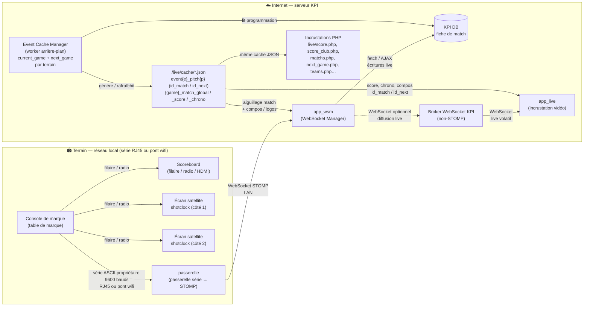
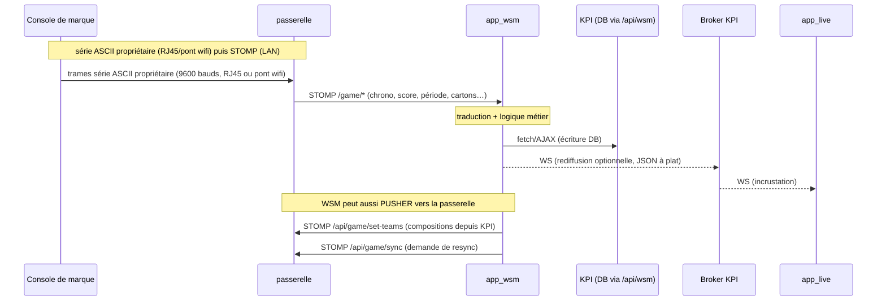
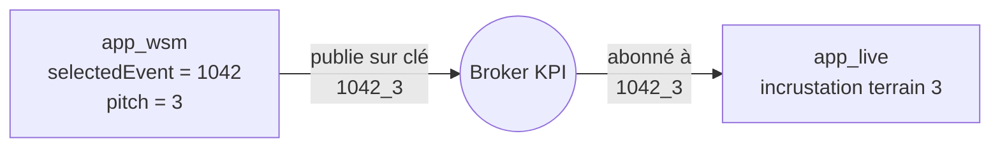
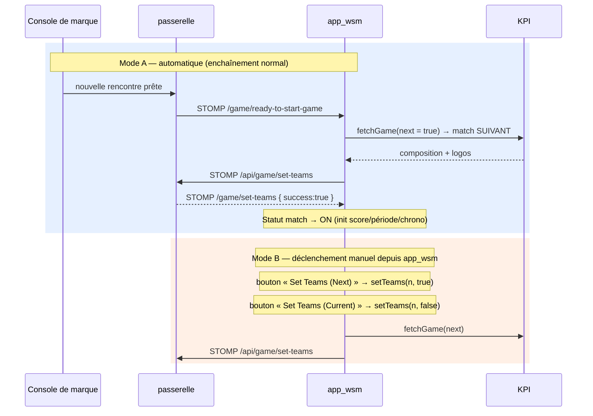
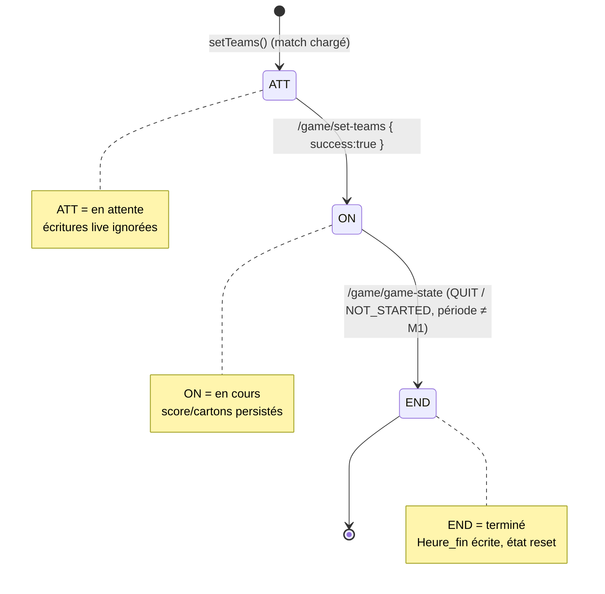
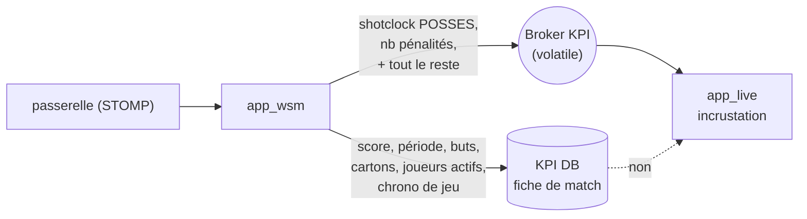
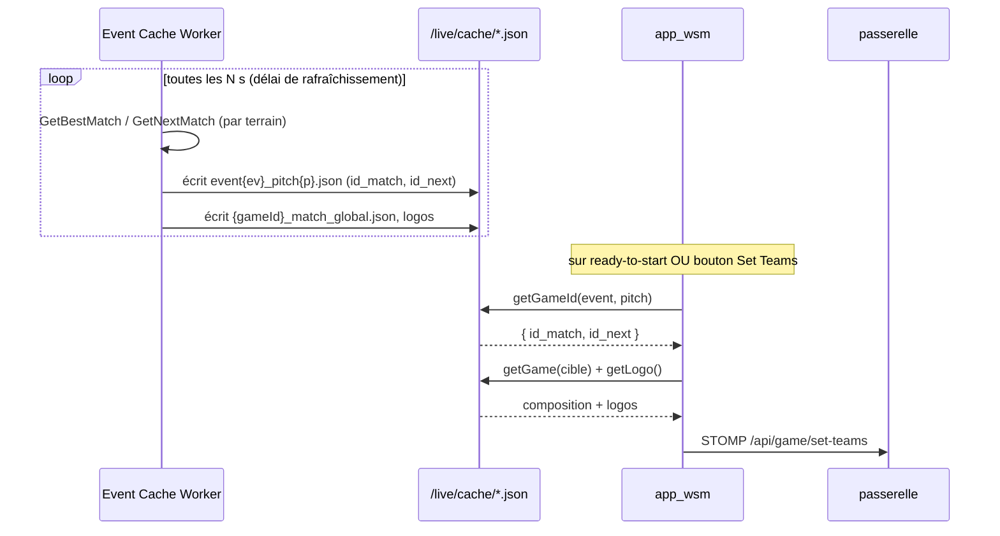
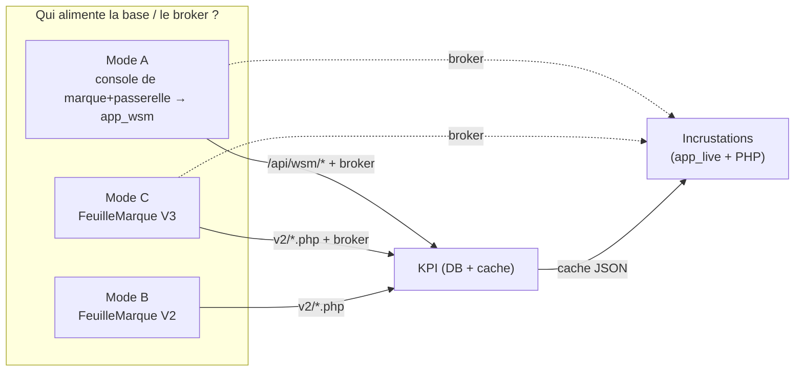

# Architecture temps réel d'un match (console de marque → WSM → KPI → Live)

Documentation technique de la chaîne de diffusion en direct d'un match de kayak-polo,
depuis la saisie sur le matériel de la table de marque jusqu'à l'incrustation vidéo.
Le mode **complet matériel** est décrit en priorité ; les modes **alternatifs et dégradés** (feuille
de marque KPI, saisie a posteriori) font l'objet de la **§14**.

> **Documents liés** : le plan de refonte (ce qu'on construit, dans quel ordre, ce qu'on supprime
> ensuite) est dans
> [LIVE_MATCH_SCORING_REFACTORING_PROPOSALS.md](LIVE_MATCH_SCORING_REFACTORING_PROPOSALS.md), et la
> revue critique — principes DRY/SOLID/DDD/TDD, décisions structurantes, périmètre de consolidation
> du legacy — dans [LIVE_MATCH_REFACTORING_REVIEW.md](../audits/LIVE_MATCH_REFACTORING_REVIEW.md).
>
> **Ce document décrit l'existant.** Deux briques d'infrastructure décrites ici sont vouées à
> disparaître dans la cible : le **broker WebSocket personnel** (§2.4) sera remplacé par **Mercure**,
> et le **cache JSON fichier** (§13) par un cache HTTP. L'audit
> [FRANKENPHP_MIGRATION_ANALYSIS.md](../audits/FRANKENPHP_MIGRATION_ANALYSIS.md) montre comment
> l'extraction d'api2 sous **FrankenPHP** fournit nativement le hub Mercure et ce cache HTTP — voir le
> §4.6 du plan de refonte pour la trajectoire.

### Terminologie — le matériel de la table de marque

La documentation ne nomme **pas la marque** du matériel de scoring. Les termes génériques employés
partout renvoient à un **panneau de score du commerce**, dont le protocole est **fermé** (non
documenté publiquement) :

| Terme employé | Ce que c'est |
|---------------|--------------|
| **Console de marque** | le boîtier de saisie de la table de marque (score, chrono, shotclock, cartons, pénalités) |
| **Passerelle** (réseau) | le boîtier qui décode la sortie série de la console et l'expose en WebSocket STOMP sur le LAN |
| **Protocole propriétaire** / **trames propriétaires** | le format série ASCII fermé émis par la console |
| **Matériel propriétaire** | l'ensemble console + passerelle, par opposition aux modes de saisie manuelle KPI |

Ce matériel n'équipe **pas tous les terrains** — voir les modes alternatifs et dégradés en **§14**.

- **Code concerné** :
  - `sources/app_wsm_dev/` — application **WSM** (WebSocket Manager)
  - `sources/app_live_dev/` — application **Live** (incrustation)
  - `sources/api/` (endpoints `/api/wsm/...`) — écritures base de données
- **Fichiers clés** :
  - [`app_wsm_dev/src/mixins/wsMixin.js`](../../../sources/app_wsm_dev/src/mixins/wsMixin.js) — cœur du manager
  - [`app_live_dev/src/mixins/wsMixin.js`](../../../sources/app_live_dev/src/mixins/wsMixin.js) — abonnements côté incrustation
  - [`app_wsm_dev/src/network/liveApi.js`](../../../sources/app_wsm_dev/src/network/liveApi.js) — écritures DB (fetch/AJAX)

---

## 0. Contexte : qu'est-ce qu'un événement ?

Pour situer l'échelle, un **événement** KPI rassemble sur un **même site** plusieurs
compétitions / catégories, réparties sur **2 à 5 jours consécutifs** :

| Dimension | Ordre de grandeur |
|-----------|-------------------|
| Durée | 2 à 5 jours consécutifs |
| Terrains | 1 à 5 en général (jusqu'à 5 pitches gérés en parallèle) |
| Matchs | quelques dizaines à **50–300+** sur l'ensemble de l'événement |
| Durée d'un slot | **30 à 40 min** par match habituellement |

Les matchs **s'enchaînent en continu** sur chaque terrain pendant ces journées. D'où l'importance
de l'**aiguillage automatique** (match courant / suivant par terrain, §13) et de l'**enchaînement**
des compositions (§10) : à ce rythme, la table de marque ne peut pas reconfigurer manuellement
chaque rencontre. La clé d'échange `<numeroEvenement>_<numero_terrain>` (§6) identifie donc un
**flux de terrain stable sur toute la durée** de l'événement, quel que soit le match en cours.

> ⚠️ **Deux « événements » à ne pas confondre.** Ci-dessus, « événement » = **événement KPI** (ce
> rassemblement multi-journées). Ailleurs dans ce document, « événement » désigne parfois un **fait
> de match** — un but ou un carton (p.ex. « Événement joueur » §9.5, `setGameEvent`, « buts/cartons »).
> Ce sont **deux échelles différentes** : l'événement KPI **contient** des centaines de matchs, chaque
> match contient des faits de match. Quand le contexte prête à confusion, on précise **« fait de
> match »** pour le second. (Modèle de données cible : `scoring_live_event`, cf.
> [PAGE_SCORING.md §0.4](../../specs/PAGE_SCORING.md).)

> ⚠️ Ce document décrit d'abord le fonctionnement **complet** avec matériel propriétaire (console de marque +
> passerelle). En pratique, **tous les terrains n'ont pas ce matériel** : les modes **alternatifs et
> dégradés** (saisie via la feuille de marque KPI, saisie a posteriori) sont décrits en **§14**.

---

## 1. Vue d'ensemble



**Idée directrice** : la console de marque est la **source de vérité** de la saisie live. La passerelle
transforme le protocole propriétaire en messages STOMP standard. `app_wsm` fait le pont entre
le LAN du terrain et Internet : il **persiste** les données dans KPI et, en option, les
**rediffuse** vers le broker KPI.

**Deux canaux alimentent les incrustations**, à ne pas confondre :

1. **Le broker WebSocket** (temps réel, volatil) — `app_wsm` y pousse le flux live (score, chrono,
   shotclock, faits de jeu) que `app_live` consomme pour l'incrustation animée.
2. **Le cache JSON** (`/live/cache/*.json`) — généré côté serveur par l'**Event Cache Manager**
   (worker), qui calcule pour **chaque terrain** le **match en cours** (`id_match`) et le **match
   suivant** (`id_next`). Ce cache est lu par **plusieurs consommateurs** :
   - `app_wsm` pour l'**aiguillage** (quel match charger) et les compositions/logos (§13) ;
   - `app_live` pour certaines valeurs (aiguillage `event{e}_pitch{p}.json`, compositions
     `{game}_match_global.json`, score `_match_score.json`, chrono `_match_chrono.json`) ;
   - les **incrustations PHP** de `sources/live/` (`score.php`, `score_club.php`, `matchs.php`,
     `next_game.php`, `teams.php`, etc.) qui lisent **exactement le même cache** (via `live/js/match.js`).

Autrement dit, `app_live` n'est pas purement « push broker » : il **combine** le flux temps réel du
broker et des **lectures de cache JSON**. Et le cache sert bien **au-delà** de la seule chaîne
WebSocket — c'est la source commune de toutes les incrustations (Vue et PHP).

---

## 2. Les maillons de la chaîne

### 2.1 Console de marque (hardware, table de marque)
Console de saisie de la table de marque. L'opérateur y saisit en direct : score, chrono de jeu
(TPS-JEU), shotclock (POSSES / temps de possession), pénalités, cartons, buts joueur, période.

Il pilote les afficheurs physiques :
- **Scoreboard** (équipes, score, temps, shotclock, pénalités) — en **filaire** ou **radio** selon
  le modèle.
- **Deux écrans satellites** de shotclock (un à chaque extrémité du terrain) — en **filaire** ou
  **radio**.
- **Écran externe** (le cas échéant) — en **HDMI**.

**Sortie protocole vers la passerelle** : la console de marque expose une **sortie série RJ45** (RS-232,
9600 bauds, 8 bits + start + stop, sans parité) transmettant des **trames ASCII propriétaires**
(trames de la forme `SOH · adresse · STX · CTRL · Message · ETX · LRC`). Le détail des trames
est **hors périmètre** de ce document. C'est ce flux que la passerelle décode puis convertit en
WebSocket STOMP.

> **Raccordement réseau console de marque ↔ passerelle** : la liaison se fait au sein du **réseau local**, soit
> par **câble RJ45 direct**, soit via un **pont wifi** (bridge) sur ce même LAN. Le choix dépend de
> l'**équipement réseau disponible et de la configuration du site**.

### 2.2 Passerelle réseau
Boîtier sur le réseau local. Reçoit les trames **série ASCII propriétaire (9600 bauds)** de la console de marque — via
**RJ45 ou pont wifi** sur le LAN — les **décode**, puis les **convertit en WebSocket STOMP** (même
réseau local). C'est elle qui expose l'URL `ws://<ip-passerelle>:<port>` à laquelle `app_wsm` se connecte.

> Exemple d'URL par défaut (paramétrable dans l'app) :
> `ws://141.94.76.66:25000` — voir `app_wsm_dev/src/ws_params.js`.

### 2.3 app_wsm — WebSocket Manager (`sources/app_wsm_dev/`)
Application Vue 3 exploitée près du terrain, sur le même réseau local que la passerelle.
C'est le **cœur** du système :
- se **connecte en STOMP** aux flux de la passerelle (un par terrain) ;
- **traduit** chaque message STOMP en écritures base de données KPI (via `fetch`/AJAX) ;
- **rediffuse** optionnellement les faits de jeu vers le broker WebSocket KPI pour le live.

### 2.4 Broker WebSocket KPI (non-STOMP)
Broker WebSocket hébergé côté KPI. **Ce n'est pas du STOMP** : `app_wsm` y publie des messages
JSON « à plat » (voir §4.2). Sert uniquement à la diffusion temps réel vers l'incrustation ;
il n'est pas la source de persistance.

> 🔭 **Cible.** Ce broker (dépôt personnel `laurentgarrigue/broker`) est destiné à être remplacé par
> **Mercure**, embarqué dans le conteneur FrankenPHP d'api2 — voir le bloc « Documents liés » en tête.

### 2.5 app_live — Incrustation (`sources/app_live_dev/`)
Construit l'**incrustation vidéo** du match (score, chrono, faits de jeu). Application « lecture
seule » du point de vue des données : elle n'écrit pas en base. Elle s'alimente à **deux sources** :
- le **broker WebSocket** (temps réel volatil : chrono, shotclock, buts/cartons) ;
- le **cache JSON** (`/live/cache/*.json`) pour l'aiguillage terrain et certaines valeurs —
  `getGameId` (`event{e}_pitch{p}.json`), `getGame` (`_match_global`), `getScore` (`_match_score`),
  `getTimer` (`_match_chrono`), `getEventNetwork` (`_network`) — cf. `app_live_dev/src/network/liveApi.js`.

### 2.6 Incrustations PHP (`sources/live/*.php`)
Pages d'incrustation historiques. Elles **ne dépendent pas** du broker WebSocket : leur JavaScript
(`live/js/match.js` + un JS par page) lit **le même cache JSON** que WSM et app_live —
`event{e}_pitch{p}.json` (avec `id_match`/`id_next.id`), `{game}_match_global.json`,
`_match_score.json`, `_match_chrono.json`. Le cache est donc la **source commune** de toutes les
incrustations (liste exhaustive en §13.3).

---

## 3. Sens des flux de données



Deux sens coexistent sur le lien STOMP WSM ↔ passerelle :

| Sens | Destination STOMP | Contenu | Déclencheur |
|------|-------------------|---------|-------------|
| **passerelle → WSM** (abonnements) | `/game/chrono`, `/game/data-game`, `/game/period`, `/game/player-info`, `/game/game-state`, `/game/team-game`, `/game/set-teams`, `/game/ready-to-start-game`, `/game/game-phase` | état live saisi sur la console de marque | saisie table de marque |
| **WSM → passerelle** (publications) | `/api/game/set-teams`, `/api/game/sync` | compositions d'équipes (issues de KPI), demande de resynchro | chargement d'un match, ready-to-start |

Sur `ready-to-start-game`, WSM charge le match suivant depuis KPI (`fetchGame`) et **pousse la
composition** (`set-teams` : noms, couleurs, maillots, logos base64, coachs) vers la passerelle, qui
peut ainsi préremplir la console de marque.

---

## 4. Détail des protocoles

### 4.1 STOMP (passerelle ↔ app_wsm)
Établi via `@stomp/stompjs` (`stompCreate` / `stompSubscribe`). Une **connexion par terrain**.
Chaque message `/game/*` est traité dans `wsMixin.js` et provoque deux effets :

1. **Persistance** via `liveApi` (voir §5) ;
2. **Rediffusion** via `broadcast(pitch, topic, value)` vers le broker (si connecté).

Exemples de mapping (extraits de `app_wsm_dev/src/mixins/wsMixin.js`) :

| Message STOMP entrant | Traitement | Écriture DB |
|-----------------------|-----------|-------------|
| `/game/data-game` (HOME/GUEST, `score`, `nbPenalities`) | met à jour `scoreA/B`, pénalités | `setGameParams(…, 'ScoreDetailA/B', …)` |
| `/game/chrono` (`TPS-JEU`) | chrono de jeu, run/stop | `setGameTimer(...)` |
| `/game/chrono` (`POSSES`) | shotclock | rediffusion seule |
| `/game/period` | période courante / prolongation (`M1`, `P1`…) | `setGameParams(…, 'Periode', …)` |
| `/game/player-info` (`score`, `card`) | but / annulation but / carton / annulation carton | `setGameEvent(...)` |
| `/game/team-game` | joueur actif/inactif | `setPlayerStatus(...)` |
| `/game/game-state` (`QUIT_MATCH`, `MATCH_NOT_STARTED`) | fin de match → `Statut='END'`, `Heure_fin` | `setGameParams(...)` |

Codes cartons (matériel → KPI) : `GREEN→V`, `YELLOW→J`, `YELLOW_RED/RED→R`, `RED_EJECTION→D`.

> **Format exact des payloads STOMP** (structure JSON, champs, valeurs possibles) : voir §9.

### 4.2 WebSocket broker KPI (app_wsm → broker → app_live) — **non STOMP**
`broadcast()` publie un JSON « à plat » sur le broker :

```json
{ "p": "<numeroEvenement>_<numero_terrain>", "t": "chrono", "v": { "time": "07:32", "run": true } }
```

- `p` = **clé d'échange** (voir §6) ;
- `t` = topic court (`chrono`, `posses`, `scoreA`, `scoreB`, `penA`, `penB`, `period`, `evt`) ;
- `v` = valeur (score, temps formaté, objet fait de jeu joueur…).

`app_live` s'abonne à cette clé et reconstruit l'affichage de l'incrustation.

---

## 5. Écritures base de données (WSM → KPI)

Toutes les écritures passent par `liveApi` (`fetch`/AJAX PUT vers `/api/wsm/...`), et **uniquement
si** la préférence `databaseSync` est active :

| Fonction WSM | Endpoint | Rôle |
|--------------|----------|------|
| `sync()` | `PUT /api/wsm/gameParam/{gameId}` | param unitaire (Score, Statut, Periode, Heure_fin…) |
| `syncTimer()` | `PUT /api/wsm/gameTimer/{gameId}` | état du chrono (startTime, runTime, maxTime, action) |
| `syncGameEvt()` | `PUT /api/wsm/gameEvent/{gameId}` | fait de jeu (but, carton) avec période/temps/joueur |
| `syncPlayerSelected()` | `PUT /api/wsm/playerStatus/{gameId}` | joueur actif/inactif |
| `generateJson()` | `PUT /api/wsm/eventNetwork/{event}` | config réseau de l'événement (URL broker global) |

Le backend écrit ensuite dans les tables de match ; les données live sont aussi exposées en
**cache JSON** (`/live/cache/event{event}_pitch{pitch}.json`, `{gameId}_match_*.json`) que WSM et
Live relisent au chargement.

---

## 6. Clé d'échange `<numeroEvenement>_<numero_terrain>`

C'est l'**identifiant logique du flux** d'un terrain donné pour un événement donné. Elle relie
`app_wsm` (producteur) et `app_live` (consommateur) via le broker sans qu'ils partagent d'état.

- Construite dans `broadcast()` : `this.selectedEvent + '_' + pitch`
  (ex. `1042_3` = événement 1042, terrain 3).
- `selectedEvent` = numéro d'événement KPI sélectionné dans WSM (préférences).
- `pitch` / `numero_terrain` = numéro de terrain, également l'`id` de connexion STOMP.



### Convention des `id` de connexion dans WSM
Le tableau `id` sert à la fois de numéro de terrain **et** de type de connexion :

| `id` | Rôle |
|------|------|
| `0` | **Broker KPI global** (diffusion live, `urlsub`) — pas de terrain |
| `1` … `19` | **Terrains** (`pitch` / `numero_terrain`), un flux passerelle STOMP chacun |
| `20` | **Faker** (injection de messages de test) |

(Contrôlé dans `urlUsed()` : seuls les `id` de `1` à `19` sont des terrains réels.)

---

## 7. Persistance locale & reprise

`app_wsm` et `app_live` stockent leurs connexions en **IndexedDB** (`idbStorage`, store
`connections`), incluant URL, topic, identifiants (mot de passe en base64), et le dernier état
connu du match (score, période, chrono…). Au démarrage, `loadConnections()` **rouvre
automatiquement** les connexions actives (`startedUrl`) et, pour les terrains, envoie une
demande de resync (`syncRequest`) 2 s après reconnexion. Cela permet de reprendre un match en
cours après un rechargement de page ou une coupure.

---

## 8. Résumé des responsabilités

| Élément | Entrée | Sortie | Persiste ? |
|---------|--------|--------|-----------|
| Console de marque | saisie manuelle | scoreboard/satellites (filaire/radio), HDMI, série ASCII propriétaire vers passerelle | non |
| passerelle | série ASCII propriétaire 9600 bauds (RJ45/pont wifi) | STOMP (LAN) | non |
| app_wsm | STOMP (passerelle) | fetch DB + WS broker | IndexedDB local |
| Event Cache Manager (worker) | programmation DB | cache JSON (`id_match`/`id_next`, compos, score, chrono) | fichiers cache |
| KPI backend | fetch `/api/wsm/*` | DB + cache JSON | **oui (DB)** |
| Broker KPI | WS (WSM) | WS (Live) | non (transit) |
| app_live | WS broker (clé `evt_terrain`) **+ cache JSON** | incrustation vidéo | IndexedDB local |
| Incrustations PHP (`live/*.php`) | cache JSON (`match.js`) | incrustation vidéo | non |

---

## 9. Référence des messages STOMP (passerelle → app_wsm)

Tous les payloads ci-dessous sont extraits des exemples réels utilisés par le **Faker** de
[`app_wsm_dev/src/views/Manager.vue`](../../../sources/app_wsm_dev/src/views/Manager.vue)
(méthode `fake()`), qui reproduit fidèlement le format émis par la passerelle. Chaque message est un
**corps JSON** publié sur une destination STOMP `/game/*` ; WSM le parse dans `stompSubscribe()`.

### 9.1 Cycle de vie du match

**`/game/ready-to-start-game`** — corps vide.
Signale que la table de marque est prête à démarrer un nouveau match. WSM réagit en chargeant le
match suivant depuis KPI et en poussant les compositions (`set-teams`).

**`/game/set-teams`** — accusé de réception des compositions envoyées par WSM.
```json
{ "success": true, "message": "" }
```
Si `success` est vrai, WSM passe le match à `Statut='ON'` et initialise score/période/chrono.

**`/game/game-state`**
```json
{ "matchState": "MATCH_RUNNING" }
```
| Valeur `matchState` | Effet WSM |
|---------------------|-----------|
| `MATCH_RUNNING` | match en cours (aucune action de fin) |
| `MATCH_NOT_STARTED` | non démarré → fin/annulation si période ≠ `M1` |
| `QUIT_MATCH` | quitté → clôture : `Statut='END'`, `Heure_fin`, reset état |

### 9.2 Périodes

**`/game/period`**
```json
{ "currentPeriod": 1, "prolongation": false, "nbPeriodInGame": 4 }
```
| Champ | Type | Description |
|-------|------|-------------|
| `currentPeriod` | int | numéro de période courante (1..n) |
| `prolongation` | bool | `true` = prolongation |
| `nbPeriodInGame` | int | nombre de périodes réglementaires |

Mapping vers KPI (`period[id]`) : période normale → `M<currentPeriod>` ; prolongation →
`P<currentPeriod-2>` (ex. `currentPeriod=3, prolongation=true` → `P1`).

### 9.3 Chronos (chrono de jeu & shotclock)

**`/game/chrono`** — un même topic pour les deux chronos, distingués par `chronoName`.
```json
{ "idChrono": 0, "chronoName": "TPS-JEU", "value": 581712, "initValue": 600000, "chronoMode": "COUNTDOWN", "started": true }
```
```json
{ "idChrono": 0, "chronoName": "POSSES", "value": 12412, "initValue": 60000, "chronoMode": "COUNTDOWN", "started": true }
```
| Champ | Type | Description |
|-------|------|-------------|
| `chronoName` | string | `TPS-JEU` (chrono de jeu) ou `POSSES` (shotclock / possession) |
| `value` | int (ms) | temps restant en millisecondes |
| `initValue` | int (ms) | valeur initiale du décompte (600000 = 10 min ; 60000 = 60 s) |
| `chronoMode` | string | `COUNTDOWN` (décompte) |
| `started` | bool | chrono en marche (`true`) ou arrêté (`false`) |

> Sous `10 000 ms`, `value` est affiché avec les dixièmes ; au-dessus, arrondi à la seconde.
> `POSSES` est purement rediffusé (shotclock), pas persisté. `TPS-JEU` déclenche `setGameTimer()`
> aux transitions run/stop. Autres `chronoName` possibles côté matériel : `PEN_H1`, `PEN_H2`,
> `PEN_G1`, `PEN_G2` (chronos de pénalité — non traités actuellement).

### 9.4 Score & pénalités (niveau équipe)

**`/game/data-game`**
```json
{ "typeTeam": "HOME", "score": "2", "nbPenalities": 0, "fault": 0, "timeOut": 0 }
```
| Champ | Type | Description |
|-------|------|-------------|
| `typeTeam` | string | `HOME` → équipe A ; sinon (`GUEST`) → équipe B |
| `score` | string | score de l'équipe |
| `nbPenalities` | int | nombre de pénalités actives — **rediffusé uniquement** en `penA/penB` (non persisté) |
| `fault` | int | fautes (non utilisé) |
| `timeOut` | int | temps mort (non utilisé) |

> **Seul le `score` est persisté** ici (`setGameParams('ScoreDetailA/B')`). `nbPenalities` alimente
> `penA[id]`/`penB[id]` et n'existe **que le temps du live** (broker + affichage WSM) — voir §12.

### 9.5 Fait de jeu joueur (but / carton)

**`/game/player-info`**
```json
{ "type": "HOME", "idPlayer": 3, "score": "1", "fault": 0, "card": "NONE" }
```
| Champ | Type | Description |
|-------|------|-------------|
| `type` | string | `HOME` → équipe A (`equipe1`) ; `GUEST` → équipe B (`equipe2`) |
| `idPlayer` | int | index du joueur (1-based ; `joueurs[idPlayer-1]`) |
| `score` | string | score **cumulé** du joueur (comparé au précédent) |
| `fault` | int | fautes (non utilisé) |
| `card` | string | carton courant : `NONE`, `GREEN`, `YELLOW`, `YELLOW_RED`, `RED`, `RED_EJECTION` |

WSM déduit l'action en comparant à l'état précédent du joueur :
- `score` augmente → **but** (`add`) ; diminue → **annulation de but** (`remove`) ;
- `card` passe à une valeur ≠ `NONE` et différente → **carton** (`add`) ;
- `card` repasse à `NONE` → **annulation de carton** (`remove`).

Chaque action est persistée via `setGameEvent()` avec le code carton KPI correspondant
(`GREEN→V`, `YELLOW→J`, `YELLOW_RED`/`RED→R`, `RED_EJECTION→D`) et un but est codé `B`.

### 9.6 Composition en jeu (joueurs actifs, pénalités, coachs)

**`/game/team-game`** — snapshot complet des deux équipes.
```json
{
  "teamGameHome": {
    "playersGame": [
      { "idPlayer": 2, "score": "0", "faults": 0, "shirtNumber": "1", "selected": true, "card": "NONE", "isBlink": false }
    ],
    "idBlinkPlayer": -1,
    "listPenaltyGames": [
      { "order": 5, "penaltyTime": 120000, "chronoNamePenalty": "PEN_H1", "penaltyInitTime": 120000, "idPlayer": -2, "typePenalty": "GREEN_CARD_MINOR" }
    ],
    "listCoachGame": [
      { "idCoach": 1, "faults": 0, "selected": true, "card": "NONE", "nameCoach": "Coach " }
    ]
  },
  "teamGameGuest": { "playersGame": [ /* … */ ], "idBlinkPlayer": -1, "listPenaltyGames": [], "listCoachGame": [ /* … */ ] }
}
```
| Champ | Type | Description |
|-------|------|-------------|
| `teamGameHome` / `teamGameGuest` | object | équipe A / équipe B |
| `playersGame[].idPlayer` | int | index joueur (1-based) |
| `playersGame[].shirtNumber` | string | numéro de maillot |
| `playersGame[].selected` | bool | joueur **actif** en jeu (persisté via `setPlayerStatus`) |
| `playersGame[].card` | string | carton courant du joueur |
| `playersGame[].isBlink` | bool | joueur clignotant (UI matériel) |
| `idBlinkPlayer` | int | joueur mis en évidence (`-1` = aucun) |
| `listPenaltyGames[]` | array | pénalités en cours (temps ms, `chronoNamePenalty` = `PEN_H1`…, `typePenalty`) |
| `listCoachGame[]` | array | coachs (id, nom, carton, actif) |

Seul le champ `selected` (joueur actif/inactif) est actuellement synchronisé en base ;
`listPenaltyGames` et `listCoachGame` sont reçus mais pas encore exploités.

**`/game/game-phase`** — reçu mais non traité (log seulement).

### 9.7 Synthèse des destinations

| Destination STOMP | Sens | Traité par WSM |
|-------------------|------|----------------|
| `/game/ready-to-start-game` | passerelle → WSM | charge match + push `set-teams` |
| `/game/set-teams` | passerelle → WSM | passe le match à `ON` |
| `/game/game-state` | passerelle → WSM | clôture de match |
| `/game/period` | passerelle → WSM | période |
| `/game/chrono` | passerelle → WSM | chrono de jeu + shotclock |
| `/game/data-game` | passerelle → WSM | score + pénalités équipe |
| `/game/player-info` | passerelle → WSM | but / carton joueur |
| `/game/team-game` | passerelle → WSM | joueurs actifs |
| `/game/game-phase` | passerelle → WSM | ignoré (log) |
| `/api/game/set-teams` | WSM → passerelle | pousse les compositions KPI |
| `/api/game/sync` | WSM → passerelle | demande de resynchronisation |

---

## 10. Démarrage & enchaînement des matchs (WSM ↔ passerelle)

C'est l'étape **la plus sensible** du système : elle charge la bonne composition d'équipes dans le
console de marque au bon moment, et détermine sur quel match les faits de jeu suivants seront imputés. Un
`set-teams` sur le mauvais match écrit les buts/cartons sur la mauvaise fiche en base.

### 10.1 Message sortant `/api/game/set-teams` (WSM → passerelle)

Publié par `setTeams(id, next)` après avoir chargé le match depuis KPI (`fetchGame`) et récupéré
les logos (`fetchLogo`, base64). Structure complète :

```json
{
  "teamHome": {
    "name": "TEAM A",
    "displayName": "TEAM A",
    "trigramName": "",
    "textColor": "#FFFFFF",
    "shirtColor": "#006480",
    "strokeColor": "#EF4135",
    "coach": [ { "id": 3, "name": "Nom Prénom" } ],
    "players": [ { "id": 1, "name": "Nom Prénom (C)", "shirtNumber": "7" } ],
    "logoBase64": "iVBORw0KGgoAAAANSUhEUg…"
  },
  "teamGuest": { "…": "structure identique" }
}
```

| Champ | Source KPI | Note |
|-------|-----------|------|
| `name` / `displayName` | `equipe1/2.nom` | nom d'équipe |
| `textColor` | `colortext` | couleur du texte sur le maillot |
| `shirtColor` | `color1` | couleur principale du maillot |
| `strokeColor` | `color2` | couleur de contour |
| `coach[]` | joueurs `Capitaine === 'E'` | encadrants (id = index 1-based, `name`) |
| `players[]` | joueurs hors coach | `id` = index 1-based, `shirtNumber` |
| `logoBase64` | `fetchLogo()` | logo encodé base64 (PNG) |

Particularités du mapping (dans `setTeams()`) :
- le **capitaine** (`Capitaine === 'C'`) voit son prénom suffixé ` (C)` ;
- les **coachs** (`Capitaine === 'E'`) sont sortis de `players` vers `coach` ;
- deux joueurs au **même numéro** consécutif → le 2ᵉ est préfixé `0` (`shirtNumber` dédoublonné) ;
- si **aucun match** n'est trouvé, WSM envoie une composition **factice** (`TEAM A`/`TEAM B`,
  10 joueurs `Player n`, logos 1×1 px) pour permettre les tests sans données.

### 10.2 Deux modes de déclenchement



**Mode A — automatique.** À la réception de `/game/ready-to-start-game` (émis par la table de
marque quand elle prépare la rencontre suivante), WSM charge le match **suivant** (`next = true`)
et pousse `set-teams`. C'est l'enchaînement nominal entre deux matchs d'un même terrain.

**Mode B — manuel (secours depuis app_wsm).** Deux boutons par terrain permettent à l'opérateur
WSM de forcer le chargement :
- **« Set Teams (Next) »** → `setTeams(n, true)` : charge le match **suivant** ;
- **« Set Teams (Current) »** → `setTeams(n, false)` : (re)charge le match **courant**.

Utile si la console de marque n'a pas émis `ready-to-start`, si la mauvaise composition a été poussée, ou
pour réinjecter les compositions après un incident.

### 10.3 « Suivant » vs « courant »

Le choix repose sur le cache KPI `event{event}_pitch{pitch}.json` (`getGameId`), **généré par
l'Event Cache Manager / worker** — voir §13 pour la production de ces fichiers :

| `next` | `gameTarget` | Cas d'usage |
|--------|--------------|-------------|
| `true` | `id_next.id` | match **suivant** dans la programmation du terrain |
| `false` | `id_match` | match **courant** / en cours sur le terrain |

`fetchGame(..., compare)` évite de recharger un match déjà actif (retourne `null` si
`gameTarget === compare` → « Same game »).

### 10.4 Bascule des statuts de match

Le champ `statutMatch[id]` reflète l'état du match côté WSM et pilote l'autorisation d'écriture :



**Point critique** : les handlers qui **écrivent en base** (`data-game`→score, `player-info`,
`chrono TPS-JEU`, `period`) ne le font **que si `statutMatch[id] === 'ON'`**. Un match resté en
`ATT` (composition non confirmée par `set-teams`) ne persiste **aucun** fait de jeu — d'où
l'importance de vérifier visuellement le passage à `ON` (voir §11).

> À l'inverse, les données **live seulement** échappent en partie à cette garde : le **shotclock**
> (`chrono POSSES`) est rediffusé vers le broker dès que `game[id]` existe, sans exiger `ON`. Voir
> §12 pour la distinction persisté / volatil.

---

## 11. Points de contrôle visuel dans app_wsm

L'interface `Manager.vue` est le **poste de supervision** : elle affiche en temps réel l'état de
chaque terrain, ce qui permet de détecter immédiatement un flux figé, un mauvais match chargé ou
une désynchronisation. Une **carte par terrain** (`pitch`) présente :

```
┌─ Pitch 3 ───────────────────────────────────────────────┐
│ [▶ Connect] [■ Disconnect]   [Sync] [Set Teams (Current)]│
│                              [Set Teams (Next)]  [💾 Save]│
├──────────────────────────────────────────────────────────┤
│  🟡🟡 CN Tours   [2]     [4]   Kayak Nantes 🟡           │  ← pénalités + score
│              M2      07:32      60                        │  ← période / chrono / shotclock
│  [10:15]            ON             #12                    │  ← heure / statut / n° d'ordre
├──────────────────────────────────────────────────────────┤
│  (flux de logs live, défilant)                           │
└──────────────────────────────────────────────────────────┘
```

### 11.1 Indicateurs par terrain

| Élément affiché | Source | Ce qu'il permet de vérifier |
|-----------------|--------|-----------------------------|
| **Noms d'équipes** | `game[n].equipe1/2.nom` | bon match chargé (bonne rencontre) |
| **Score A / B** | `scoreA[n]` / `scoreB[n]` | cohérence avec le scoreboard terrain |
| **Pénalités** (🟡 pastilles) | `penA[n]` / `penB[n]` | pénalités actives par équipe |
| **Période** (badge) | `period[n]` | `M1`, `M2`, `P1`… |
| **Chrono de jeu** (badge) | `tpsJeuFormated[n]` | temps ; **vert = en marche**, **rouge = arrêté** (`statutChrono`) |
| **Shotclock** (pastille bleue) | `possesFormated[n]` | temps de possession |
| **Statut du match** (badge) | `statutMatch[n]` | **gris = ATT**, **bleu = ON**, **vert = END** |
| **Heure** | `game[n].heure` | horaire programmé |
| **N° d'ordre** | `game[n].numero_ordre` | position du match dans la programmation |
| **Flux de logs** | `printLog()` | fil des faits de jeu reçus/traités en direct |

> Le **code couleur du chrono** (vert/rouge) et le **statut** (gris/bleu/vert) sont les deux
> repères les plus utiles : un chrono rouge alors que le jeu tourne, ou un statut resté **ATT**
> pendant un match en cours, signalent un problème à corriger (souvent via **Set Teams** ou
> **Sync**).

### 11.2 Actions manuelles par terrain

| Bouton | Méthode | Effet |
|--------|---------|-------|
| ▶ **Connect** | `startUrl(n)` | ouvre la connexion STOMP du terrain |
| ■ **Disconnect** | `stopUrl(n)` | ferme la connexion |
| **Sync** | `syncRequest(n)` | réinitialise l'état local et demande un resync à la passerelle |
| **Set Teams (Current)** | `setTeams(n, false)` | recharge la composition du match **courant** |
| **Set Teams (Next)** | `setTeams(n, true)` | charge la composition du match **suivant** |
| 💾 **Save** | `saveConnection(n)` | persiste la connexion en IndexedDB |
| **Send** | `sendMessage(n)` | publie un message STOMP brut (debug) |

### 11.3 Contrôles globaux

- **Sélecteur d'événement** — choisit `selectedEvent` (verrouillé si des connexions sont
  actives) ; base de la clé d'échange `<event>_<terrain>`.
- **Pitches** (slider 1–8) — nombre de terrains affichés.
- **Database sync** (interrupteur) — active/coupe les écritures DB (`prefs.databaseSync`). **Coupé,
  aucun fait de jeu n'est persisté** (utile en test).
- **KPI Broker** (carte) — connexion au broker de diffusion live (`id 0`), avec bouton
  **Generate sub json** (`generateJson()` → écrit la config réseau de l'événement) ; un badge
  **Running…** confirme la connexion.
- **Faker** (carte, `id 20`) — banc de test : boutons injectant les messages STOMP simulés (Ready,
  Running, périodes, chronos, buts, cartons…) sans matériel réel (voir §9).
- **View lighter** (`viewLighter()`) — masque les champs de configuration pour ne garder que les
  cartes de supervision (mode « écran de contrôle »).

---

## 12. Données persistées vs données « live seulement »

Toutes les données reçues de la passerelle **ne sont pas égales** : certaines sont écrites en base KPI
(fiche de match définitive), d'autres n'existent **que le temps du direct** (affichage WSM +
rediffusion broker vers l'incrustation), puis disparaissent.

### 12.1 Persisté en base (via `/api/wsm/*`, si `databaseSync`)

| Donnée | Message source | Endpoint |
|--------|----------------|----------|
| Score équipe | `/game/data-game` (`score`) | `setGameParams('ScoreDetailA/B')` puis `ScoreA/ScoreB` en fin de match |
| Chrono de jeu (run/stop) | `/game/chrono` `TPS-JEU` | `setGameTimer()` |
| Période | `/game/period` | `setGameParams('Periode')` |
| But / carton joueur | `/game/player-info` | `setGameEvent()` |
| Joueur actif/inactif | `/game/team-game` (`selected`) | `setPlayerStatus()` |
| Statut & heure de fin | `/game/game-state` | `setGameParams('Statut'/'Heure_fin')` |

### 12.2 Live uniquement — **jamais écrit en base** (à ce stade)

| Donnée | Message source | Où elle vit | Pourquoi non persistée |
|--------|----------------|-------------|------------------------|
| **Shotclock** (temps de possession) | `/game/chrono` `POSSES` | `possesFormated[id]` (badge WSM) + `broadcast('/posses')` vers broker | valeur volatile (change chaque dixième), n'a de sens qu'en direct ; l'incrustation la réaffiche en temps réel |
| **Pénalités** (nombre par équipe) | `/game/data-game` (`nbPenalities`) | `penA[id]`/`penB[id]` (pastilles WSM) + `broadcast('/penA' / '/penB')` | compteur d'état instantané ; seuls les cartons individuels (`player-info`) sont archivés comme faits de jeu |
| **Chronos de pénalité** | `/game/chrono` `PEN_H1/H2/G1/G2` | — (non traités) | non exploités actuellement |
| **`listPenaltyGames`, `listCoachGame`** | `/game/team-game` | — | reçus mais non exploités |
| **Fautes / temps morts** | `data-game.fault`, `.timeOut` | — | champs ignorés |



> **À retenir** : le **shotclock** et le **compteur de pénalités** sont des données d'affichage
> temps réel. Elles transitent WSM → broker → `app_live` mais **ne laissent aucune trace** dans la
> fiche de match. Seuls les **cartons individuels** (issus de `player-info`) sont historisés comme
> événements via `setGameEvent()` (faits de jeu).

---

## 13. Dépendance au cache JSON (Event Cache Manager / worker)

WSM ne « devine » pas quel match charger : il s'appuie sur des **fichiers JSON de cache** générés
côté serveur par l'**Event Cache Manager**, désormais un **worker en arrière-plan** (indépendant du
navigateur). Sans ces fichiers à jour, `setTeams()` et l'enchaînement (§10) ne peuvent pas
fonctionner.

- **Doc utilisateur** : [EVENT_CACHE_MANAGER.md](../../user/EVENT_CACHE_MANAGER.md)
- **Doc technique** : [`sources/live/EVENT_WORKER_README.md`](../../../sources/live/EVENT_WORKER_README.md)
- **Génération** : [`sources/live/create_cache_match.php`](../../../sources/live/create_cache_match.php) (`Pitch()`, `GetBestMatch()`, `GetNextMatch()`)

### 13.1 Ce que le worker calcule

Pour chaque terrain, à intervalle régulier, le worker détermine en fonction de l'heure courante :
- le **match en cours** (`current_game`) → `GetBestMatch()` ;
- le **match suivant** (`next_game`) → `GetNextMatch()`.

Il écrit alors le fichier d'aiguillage du terrain :

**`/live/cache/event{event}_pitch{pitch}.json`** (produit par `Pitch()`)
```json
{ "id_match": 10842, "pitch": 3, "id_next": { "id": 10843, "num": 57, "time": "10:45" } }
```
| Champ | Rôle |
|-------|------|
| `id_match` | id du match **courant** sur le terrain (`current_game`) |
| `id_next` | objet du match **suivant** (`next_game`) — WSM lit `id_next.id` |
| `pitch` | numéro de terrain |

### 13.2 Comment WSM le consomme

`getGameId(event, pitch)` lit ce fichier ; `setTeams(id, next)` choisit ensuite la cible :

| Déclencheur WSM | `next` | Cible chargée |
|-----------------|--------|---------------|
| `/game/ready-to-start-game` (auto) | `true` | `id_next.id` → **match suivant** |
| bouton **Set Teams (Next)** | `true` | `id_next.id` → **match suivant** |
| bouton **Set Teams (Current)** | `false` | `id_match` → **match courant** |

La composition détaillée (joueurs, couleurs) et les logos proviennent d'autres fichiers de cache,
également générés côté serveur :

| Fichier de cache | Généré par | Lu par WSM via |
|------------------|-----------|----------------|
| `event{event}_pitch{pitch}.json` | worker (`Pitch()`) | `getGameId()` |
| `{gameId}_match_global.json` | `Match()` | `getGame()` → compositions |
| `logos/logo_{numero}.json` | cache logos | `getLogo()` → `logoBase64` |
| `event{event}_network.json` | `setEventNetwork()` (WSM lui-même) | `getEventNetwork()` |



### 13.3 Le cache est partagé par **toutes** les incrustations

Le même cache JSON alimente plusieurs consommateurs — ce n'est pas propre à WSM :

| Consommateur | Lit | Via |
|--------------|-----|-----|
| **app_wsm** | aiguillage + compos + logos | `getGameId`, `getGame`, `getLogo` |
| **app_live** (`sources/app_live_dev/`) | aiguillage, compos, **score**, **chrono** | `getGameId`, `getGame`, `getScore` (`_match_score`), `getTimer` (`_match_chrono`), `getEventNetwork` |
| **Incrustations PHP** (`sources/live/*.php`, voir liste ci-dessous) | aiguillage, compos, score, chrono | JS `live/js/match.js` : `event{e}_pitch{p}.json`, `{game}_match_global/_score/_chrono.json` |

**Pages d'incrustation PHP consommant le cache** (toutes incluent `live/js/match.js`) :

| Famille | Pages |
|---------|-------|
| Score (nations) | `score.php`, `scoreHD.php`, `score_e.php`, `score_o.php`, `score_s.php` |
| Score (clubs) | `score_club.php`, `score_club_e.php`, `score_club_o.php`, `score_club_s.php` |
| Équipes / compositions | `teams.php`, `teams_club.php`, `liveteams.php` |
| Prochain match | `next_game.php`, `next_game_club.php` |
| Multi-terrains | `multi_score.php`, `multi_score2.php` |
| Listes / présentation | `matchs.php`, `liste_matchHD.php`, `presentation.php`, `presentationHD.php` |

> **Suffixes des pages Score** (libellés issus de la liste des présentations dans
> [`sources/app4/types/tv.ts`](../../../sources/app4/types/tv.ts), `TV_PRESENTATIONS`) :
> - `_o` = **Score only** (bandeau score seul) ;
> - `_e` = **Events only** (buts/cartons seuls) ;
> - `_s` = **Static events** (faits de jeu figés) ;
> - sans suffixe = **Live score** (bandeau complet) ; `HD` = variante haute définition.
>
> Chaque famille existe en version *nations* (`score*`) et *clubs* (`score_club*`).
> `presentationHD.php` s'appuie sur `score.js` (pas `match.js`) mais lit le même cache.

> ⚠️ **Dette identifiée — cible de consolidation (DRY).** Cette famille représente **~20 pages
> quasi dupliquées** : mêmes données, variantes mécaniques nations/clubs × suffixes d'affichage
> (`_o`/`_e`/`_s`/HD). C'est **le plus gros gisement d'harmonisation du legacy live**, et la
> condition de la mort du cache JSON fichier : tant que ces pages existent, la génération de cache
> reste obligatoire. La refonte les remplace par **une page unique paramétrée** — voir
> [le plan de refonte, §3.2 et étape 3](LIVE_MATCH_SCORING_REFACTORING_PROPOSALS.md).

Points à retenir :
- **`app_live` n'est pas 100 % broker** : il lit aussi le cache (score `_match_score`, chrono
  `_match_chrono`, compositions `_match_global`, aiguillage `_pitch`). Le broker apporte la couche
  temps réel volatile ; le cache apporte l'état « posé » et l'aiguillage.
- Les **incrustations PHP** fonctionnent **entièrement sur le cache**, sans broker WebSocket : elles
  restent à jour tant que le worker régénère les fichiers, même si aucune passerelle/WSM n'est active.

### 13.4 Conséquences pratiques

- Le worker **doit tourner** (statut *Running*) pendant l'événement : s'il est arrêté ou en retard,
  `id_match`/`id_next` sont périmés → WSM chargerait un mauvais match (ou aucun).
- Le **délai de rafraîchissement** du worker conditionne la fraîcheur de l'aiguillage : un match qui
  vient de se terminer n'est reconnu « suivant » qu'après le prochain passage du worker.
- En cas d'aiguillage erroné, l'opérateur WSM peut **forcer** via **Set Teams (Current/Next)** —
  mais cela relit le **même cache** ; si le cache lui-même est faux, il faut d'abord corriger la
  programmation puis laisser (ou forcer) le worker régénérer les fichiers.

---

## 14. Modes de fonctionnement (complet, alternatifs, dégradés)

Le fonctionnement décrit dans les §1–13 est le mode **complet matériel** : console de marque + passerelle sur le
terrain, `app_wsm` qui persiste et rediffuse. Mais sur un événement réel, **tous les terrains ne
disposent pas** de ce matériel (pas de console de marque, ou pas de connexion passerelle pour certains terrains).
La gestion du match se fait alors **en parallèle**, par d'autres outils de saisie. Le point commun
de tous les modes : **alimenter la base KPI et/ou le cache** pour que les incrustations affichent au
moins les bonnes informations.

### 14.1 Tableau comparatif

| Mode | Saisie | Écritures DB | Temps réel (broker WS) | Incrustation obtenue |
|------|--------|--------------|------------------------|----------------------|
| **A — Complet matériel** (§1–13) | console de marque → passerelle (STOMP) → `app_wsm` | `fetch` `/api/wsm/*` | oui (WSM → broker) | complète (score, chrono, shotclock, faits de jeu) |
| **B — Feuille de marque V2** | opérateur, `FeuilleMarque2.php` | écritures directes via **fichiers PHP** (`v2/*.php`) | **non** | via cache : score, période, faits de jeu (pas de flux live broker) |
| **C — Feuille de marque V3** | opérateur, `FeuilleMarque3.php` | écritures directes via **fichiers PHP** (`v2/*.php`) | **oui** (broker WS, non-STOMP) | complète, proche du mode A |
| **D — Saisie a posteriori** | après le match (ou aucune saisie live) | à froid | non | **minimale** : noms d'équipe uniquement |
| **E — Score seul** *(manquant)* | score en direct, sans chrono | — | — | **souhaité** : noms + score, sans le temps — **non implémenté** |

### 14.2 Mode B — Feuille de marque V2 (sans WebSocket)

`sources/admin/FeuilleMarque2.php` (legacy jQuery, JS `v2/fm2_*.js`). L'opérateur saisit le déroulé
du match ; chaque changement est **écrit directement en base via des fichiers PHP dédiés** :

| Action | Cible PHP |
|--------|-----------|
| Statut de match / période | `v2/StatutPeriode.php` |
| Chrono (lancement / arrêt) | `v2/setChrono.php`, `v2/ajax_updateChrono.php` |
| Fait de jeu (but, carton) | `v2/evt_match.php` |

**Aucun WebSocket** : `fm2_*.js` ne contient ni broker, ni STOMP. L'incrustation reste alimentée
**par le cache** (le worker relit la base et régénère `_match_global/_score/_chrono.json`). C'est le
mode dégradé « base seulement » : correct pour l'affichage, mais **sans la fluidité temps réel** du
broker (latence = période de rafraîchissement du cache).

### 14.3 Mode C — Feuille de marque V3 (fichiers PHP + broker WebSocket)

`sources/admin/FeuilleMarque3.php` (JS `v2/fm3_*.js`). Même principe de persistance que V2
(**écritures directes via `v2/*.php`** : `StatutPeriode.php`, `setChrono.php`, `evt_match.php`…),
**plus** une diffusion temps réel vers le **broker WebSocket KPI** :

- `fm3_C.js` lit `../live/cache/event{event}_network.json` (champ `network.global`) pour obtenir
  l'URL du broker, puis ouvre `new WebSocket(url, topic)` — **broker brut, non-STOMP**, comme
  `app_live` (cf. §4.2) ;
- `fm3_A.js` publie les faits de jeu (`socket.send(JSON.stringify(...))`) sur ce broker.

C'est donc un mode **quasi complet sans matériel propriétaire** : l'opérateur remplace la console de marque, KPI
remplace la passerelle/WSM pour la partie diffusion. L'incrustation reçoit à la fois le **live broker**
et le **cache**.

> **Nuance vs la question initiale** : V3 n'écrit **pas** (à ce stade) via api2 REST mais via les
> mêmes **fichiers PHP** que V2 ; la nouveauté de V3 par rapport à V2, c'est **l'ajout du broker
> WebSocket**. La refonte **Scoring** dans app4 (voir [PAGE_SCORING.md](../../specs/PAGE_SCORING.md))
> remplacera V2/V3 et unifiera ces écritures sur **api2**.



### 14.4 Mode D — Saisie a posteriori (incrustation minimale)

Si un terrain n'a **ni matériel propriétaire ni saisie live** (feuille de marque remplie plus tard, ou
match saisi à froid), il n'existe **pas de flux temps réel**. Le cache ne contient alors que les
**données de programmation** (équipes, horaire, aiguillage `id_match`/`id_next`). L'incrustation se
limite donc à l'**affichage des noms d'équipe** (via `_match_global.json`), sans score live ni
chrono. Les résultats définitifs apparaissent une fois la saisie effectuée et le match validé.

### 14.5 Mode E — Score seul (manque identifié)

Il **manque actuellement** un mode intermédiaire : la **saisie du seul score en direct** (sans
gérer le chronomètre), pour produire une incrustation **noms d'équipe + score**, sans le temps.
Utile pour un terrain sans console de marque où un opérateur veut au moins diffuser le score en direct sans
la charge d'un chrono complet. **À implémenter** (probablement dans la future console **Scoring**
app4).
